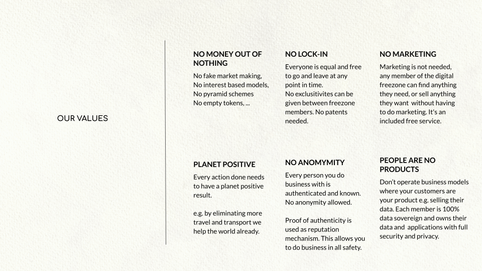
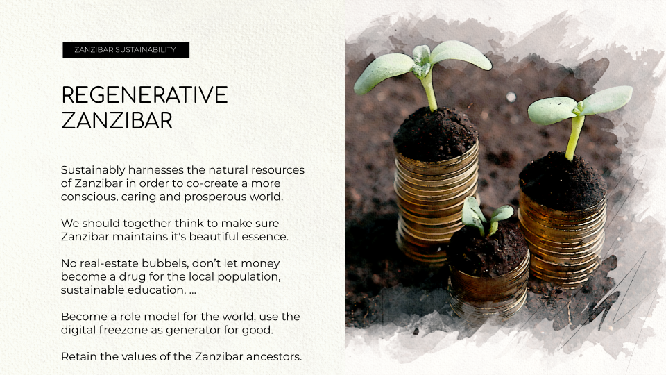
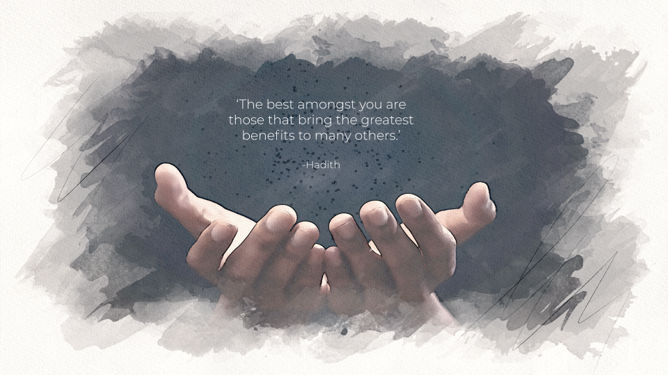

Zanzibar Digital Freezone

# What is it

The Zanzibar Digital Nomad Business Hub model is simple, effective and compelling for everyone involved..

Each person/company can create a legal entity in the Zanzibar Digital FreeZone < 1 day. Onboarded with full background checks and due diligence (KYC/AML), consistent with international standards.. 100% Compliant and Secure.

Start doing business the next day 100% of business tasks are automated.

Simple pricing model $30-$1000 per month depending on target, person, company and it's size. 

Digital Nomads = first target.

## Issues digital nomads need to deal with today.

Digital nomads have no fixed residence, which creates challenges to organizing their business affairs. 

As a result, most choose to live "off the grid" , operating informally, on a cash basis, or through pre-covid, personal online banking relationships.  . .

B2B transactions can also be difficult and time-consuming due to the challenges presented by performing due diligence on digital nomads. 

The Zanzibar Digital Freezone (ZDF) provides digital nomads with a simple, reliable means to formalizing their businesses and facilitating commercial relationships in a manner that increases productivity and decreases risk, while at the same time generating revenue for Zanzibar..  

## Benefits For the digital nomad

### Zero-Complexity

Our unique digital twin IT system allows a digital nomad to simplify his personal business life i.

### Within the ZDF, Nomads will have the following capabilities:  

* Communication (messaging, email, video conferencing)
* Invoicing, Expenses, Accounting, other administrative tasks.
* Data Storage (all  data is stored securely onlinet)
* Contract management with business partners and service providers
* HR relations.
* Project management
* Collaboration through online project management toolsDigital Currency wallet 

Every task  is 100% automated and peer2peer with business counterparts, requiring no manual action, e.g.,  invoices are generated and sent digitally and securely (and permanently recorded on a blockchain..

### Prepare for an unsure future

Whatever might happen in the nomad’s homeland, his company and its assets are safe and secure,  well-regulated online environment . The plan is to add capabilities over time as the ZDF expands organically and its growth potential  is clear.

In particular, as the use of token-based currency models (security tokens, utility tokens, digital currencies) grows, this is a capability the DFZ should provide for its community. 

Prepare for the future, digital tokens will be important

### Convenience

EASY COLLABORATION, tool-driven collaboration all hosted in Zanzibar. 

### Collaboration: 1+1 = 3

Find like-minded innovative partners, collaborate to build bigger projects with least effort and maximum protection. Attract like-minded entrepreneurs in Zanzibar.

Together create a better world. Zanzibar can be the home for a digital ecosystem of like minded digital nomad entrepreneurs.

# Benefits

## For Zanzibar

**Zanzibar is a beautiful location and wants to stay as such, getting other sustainable sources of income can help.**

Zanzibar Digital FreeZone is a sustainable business & incubation center.

100% sustainable, zero impact on the environment, culture or local economy.

The revenue generated from the Zanzibar Digital FreeZone can be used for:

* Promotion & Growth of the Digital Freezone

* Incubation of more projects, which creates value for Digital Freezone.

* Development of Sustainability projects.

* Government functions

### High Tech In Zanzibar

World class IT system will provide: data sovereignty, transparent reporting, productivity tools, conscious Tech Hub.

### Healthy Tourism = for digital nomads

x% of the digital nomads will spend some time in Zanzibar, this leads to secondary benefits for Zanzibar (Tourism).

### Modern Sustainable Physical FreeZone location for digital nomads

To Be Determined with the Government of Zanzibar, this leads to benefits...

See further for more details.

## For The Planet

We maintain a strong set of values to make sure that we do our business to the utmost ethical standards.

# Strong Protection

Zanzi Hub is strongly protected and compliant.

## 100% in line with regulation, we don’t wanna be rebels

We use the legal tools available to create a full legal sandbox in line with all published regulations.

## Legal Framework

A good enough legal framework needs to be implemented, a simple set of regulations is needed, we will work together with other offshore centers to get all the starting information. Official judges and lawyers are available in Zanzibar to provide support when required, if not required Judges and Lawyers who are members of the sandbox can be certified as well to operate in Zanzibar in the sandbox.

## No Anonymity and Proof of Authenticity

Every party you do business with in the sandbox is registered on the blockchain and has identity verified.

Every person needs to keep a profile page updated and a proof of authenticity mechanism is used to make sure the information you provide is authentic. Everyone needs to find other people who are willing to use their credibility to give you a proof of authenticity. KYC and AML are done when entering the sandbox.

## We should also offer Shariah Compliant products.

Our idea is that there will be option for our customers to do business in a Shariah Compliant way, this will have to be developed as we go.

## Verifiable Information

Source code based, all information used towards sandbox or in any business relationship is available, complete enough, version controlled and can be inspected by all involved parties at any point in time. 

All information is kept forever and archived, verified on blockchain in the sandbox (cannot be manipulated).

What you see is what you get (proof of authenticity of all information)

## Strong Digital Backbone

Our unique technology delivers strong safety mechanism

* Every participating party is strongly identity verified.

* All information used is verifiable.

* There is approval for authenticity and completeness of information (are things understandable).

## Planet Positive

Members are encouraged to do business in a positive manner - as part of the ethos of the Digital Free Zone. 

Planet Positive Means

* Everyone has Equal Chances

* No Money Out of Nothing 

* Respect for the Resources of Planet

* Sustainable (is not a short living thing, resources used as good as possible)

* All reasonable effort is done to be at least Carbon Neutral

* Tokens are created only for the benefit of a project 

A wisdom council can be used to vouch for the planet's positive nature of a project.

# Business Model

>TODO

Imagine a plan where we go for 200.000 digital nomads in the Zanzibar freezone. This potentially leads to +300m USD income for Zanzibar country, of course we cannot promise that this number will be achieved, it could be a lot more or less.
> TODO

# Simulator see: [TODO](https://threefold.docsend.com/view/) 

# Zanzibar Hub Participants

For this doc we call the Digital Nomad Business Hub, Zanzi Hub.

## Zanzi Community

The sandboxed community, all members together. The sandbox authority protects the rights of the Zanzi Community. 

## Zanzi Member

Anyone can become a member of the Zanzi Community.

A member is allowed to use tokens from the sandbox and has insight into information of company's inside the sandbox. Members can use (buy) services from companies in the sandbox. All members went through KYC and AML. There is no VAT involved for the services from within the sandbox

## Zanzi Company's

There are 4 types of companies to start with, this need to be refined but just ideas to get started with.

 

Nomad

* 1 shareholder max.

* max revenue per year = 50.000 USD

* No voting structure

Soho

* 10 shareholders max

* max revenue per year = 200.000 USD 

* No limitations around voting & distribution of profits.

Commercial

* Unlimited shareholders

* Unlimited revenue

* No limitations around voting & distribution of profits.

Cooperative (not for profit) 

* Unlimited shareholders

* Unlimited revenue

* Good regulations around voting

* Money can only be used to the benefit of the cooperative, not the shareholders.

Each company automatic monthly reporting about 

## Sandbox Authority (SA)

The company in Zanzibar which organizes and checks the correct operation of the sandbox= Zanzi Community (is the digital freezone company)

Much of this further needs to be defined as we go.

The SA has following rights & duties:

* Create companies in Zanzibar (need interface to Zanzibar registration office/system)

* Organize the Wisdom Councils (management councils, working to be further defined)

* Provide documentation and reporting to Zanzibar for whatever is required

## Zanzibar Government

The Sandbox Authority operates in a 100% legal environment as approved by the Zanzibar Government.

## Zanzi Chain

The native blockchain to the Zanzibar Sandbox. All native and wrapped required tokens are registered on this blockchain. All identity and official documents as well. So are reputation and verification proofs.

The Zanzi Chain is based on opensource blockchain code and copies of the blockchain are made on a quantum safe storage system which means data can never be lost nor corrupted.

# Zanzi Hub Admin/Financial System

## No Banks in phase 1

To keep things simple, there are no banks involved in phase 1.

Only wrapped and native tokens = digital currencies can be used (see below).

## Native Tokens

Every company can register their own tokens inside the ZaniChain.

## Gold Phase 2 (optional)

In 2022 work can start to see how gold tokens can be integrated in the sandbox, how people can come into the system by buying gold. Gold could potentially come from sustainable sources.

## Banks Phase 3

2023+, a real banking license can be acquired and made available to members of the sandbox.

Potentially this can happen faster by means of cooperation with another bank outside of the sandbox.

## Zanzi Community is not a tax free zone

The tax system is super simple.

* Income tax = 5% (first 10.000 companies are exempt for 5 years)

* Capital gains & wealth tax = 0

The tax is required to allow Zanzibar to run a sustainable government to protect the interest of the Zanzi Community.

We do realize this needs to be looked at in a broader context and will need some time to establish.

# Zanzi Hub Location

The digital freezone and digital banking services within Zanzibar are really attractive incentives for the digital nomad community and any startup that wants to innovate here. The expected development and influx of talented individuals create the need for a digital/cyber city where businesses and their employees can live and innovate together. It is crucial that this need is met while ensuring the environmental, social and financial sustainability of the growth in the country. Sustainable cities and communities are growing trends in the world of real estate development. The Zanzibar Sustainable Cyber City is a fully fledged carbon neutral mixed use project in development that aims to create dynamic communities and destinations that drive economic growth and contribute to the diversification of the economy.

The Zanzi Hub is located in Fumba on a 1 million square meters plot. Fumba is planned  to be a free economic zone with a planned government city, business center, sport centers, medical city, university and many other facilities. The government has prepared a master plan of the region with the plot of the Zanzi Hub reserved for development. The plot is 15 km from the airport and 18 km from Stone Town. 

The project will be a catalyst in bringing together the strength of government with the entrepreneurship of the private sector. It will also foster innovation and collaboration by housing various digital businesses and talented individuals in one location within Zanzibar. The sustainable cyber city will provide:

It's not just a freezone location, it's an example in the world of how digital can be connected to physical space. How sustainability is all that matters, it's an example for the future. Eventually millions of people can call this home while maybe physically few thousands of people will live there. 

# Next steps

Sign MOU between Zanizabar government and ThreeFold to further develop this project. Make a video together to allow us to show this to our investors. 

## What do we need from Zanizabar government

* Legal protection and official status in line with values as defined above.

* Give rights to our Sandbox Authority for creating companies in an automated way, 
integrate where required with Zanzibar existing systems.

* Ability to use blockchain as legal tender and signing rights, 
recognition that digital currencies can be used by the company's inside the Zanzi Hub.

* Piece of land we can use to build the freezone.

* Connection to the legal/court system when that would be required.

* Joint marketing power for the new Internet Project as well as Zanzi Hub Project.

## Possible Timing

## 

> TODO

# Conclusion

ThreeFold and the Zanzibar Government aim to establish the world's first Digital Nomad Business Hub. Targeting the growing market of Digital Nomads, through affordable, digitally secure and transparent trade license provisioning, and at a later stage by creating physical leased offices and an incubation center powered by a decentralized cloud infrastructure. These initiatives will support the development of a tech startup environment, provide for local training, education and youth empowerment facilities within Zanzibar. The combination of scalable virtual services and sustainably implemented physical spaces will attract foreign investment as well as provide a solid economic model for the country whilst empowering Zanzibar's citizens through job creation and increased economic activity (lease and licensing). Together we are confident we can achieve this vision to create a leading, digital economic hub to empower the future of Zanzibar. 

 

# More Information	

* Presentation: [https://threefold.docsend.com/view/5fysz492bkccf794](https://threefold.docsend.com/view/5fysz492bkccf794) 

