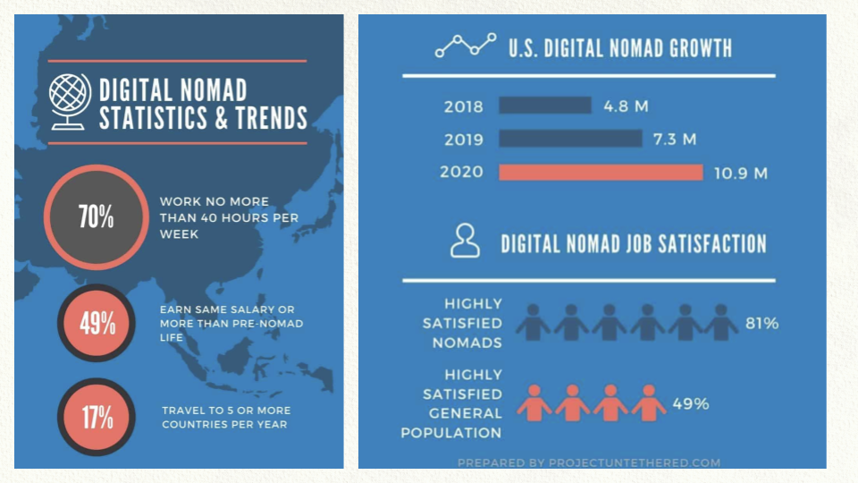

# Primary market digital nomads

10.900.000 Digital Nomads from the US in 2020.

Over the past three years, Emergent Research and MBO Partners have collaborated on an extensive digital nomad study. We found that the number of Americans describing themselves as digital nomads rose from 7.3 million in 2019 to 10.9 million in 2020 — an increase of 49%. And the composition of this cohort shifted. In previous years, the ranks of digital nomads were dominated by independent workers: freelancers, independent contractors, and the self-employed. But the 2020 nomad surge was driven by people with traditional jobs. Untethered from their offices, many employees decided to take to the road. In fact, the number of digital nomads with traditional jobs rose from 3.2 million in 2019 to 6.3 million in 2020 — a 96% increase. Traditional job holders now make up a majority of those pursuing this nontraditional work lifestyle.

### Some Global Statistics:

There are over 35,000,000 digital nomads across the globe of varied nationalities

The global digital nomad community’s economic value is $787,000,000,000 per year, calculated as the aggregate of digital nomad spending annually.

If the global digital nomad community were a country, it would rank #41 by population size, just after Canada (37,742,154) and Morocco (36,910,560) in population size

If the global digital nomad community were a country, it would 38th most prosperous country based on gross national income per capita, ranking just after Portugal ($23,200 average annual income per person) and Saudi Arabia ($22,840 average annual income per person)

The average digital nomad has a higher monthly budget than the average income of citizens from the top 5 countries, digital nomads prefer to nomad, and 9 of the top 10 countries for digital nomads

 Taxes were reported as one of the major struggles for digital nomads.