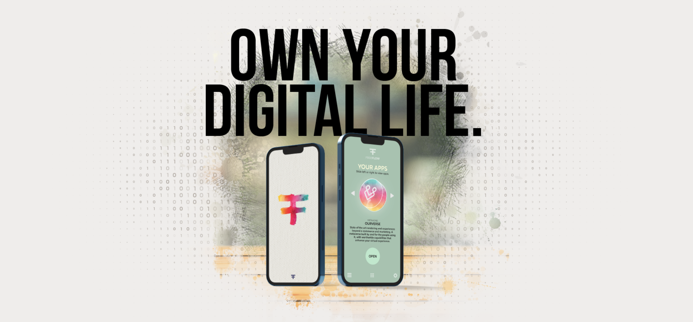
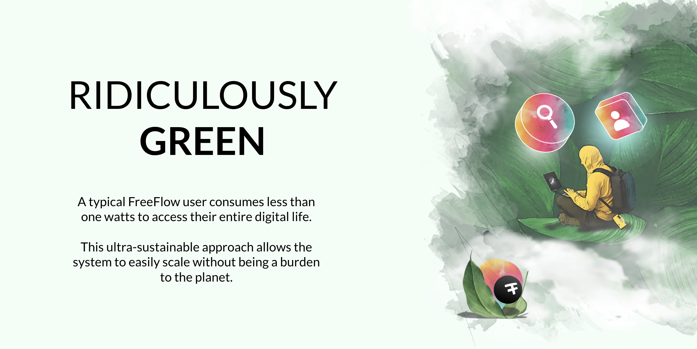

# Reserve (buy) your twin.

  

Each twin you buy is represented by a token as an NFT, this token is called a 'FFK' = FreeFlow Key, as in your key to a digital life.

You can buy more than one FFK and keep them for later, or give or re-sell them to your friends.

A FFK is valuable, it gives you access to a digital life for a lifetime.

> Some estimate that our digital life is worth 10.000 USD per year, you can now buy an alternative way for 60-200 USD for a lifetime.

 

### Reserve your twin now:
 

SOON: you will be able to go onto the Freeflow portal and reserve your twin.

| # Twin    | Price per FFK | Discount | Total Price |
| --------- | ------------- | -------- | ----------- |
| 1 Twin    | $200          | 0%       | $200        |
| 35 Twin   | $140          | -30%     | $4.900      |
| 500 Twin  | $100          | -50%     | $50.000     |
| 2500 Twin | $60           | -70%     | $150.000    |

## SHARING ECONOMY

**SPECIAL, YOU CAN GIFT 3 TWINS per TWIN bought:**
> each FFK gives you the right to give away 3 other FFK’s to people who cannot afford to buy or rent an FFK, or to your friends. A free FFK is the same as a normal FFK but has less storage & compute capacity, and certain features may not be available on a free FFK. 

*This will be enabled later this year.*

## FFK's are scarce

At start there are only 1.000.000 FFKs available. The DAO will have to approve more of them later and the price is expected to be different. 

From every initial FFK sold 30% goes to ThreeFold (technology provider) and 70% goes to FreeFlow Treasury. Do note there is only a certain amount of storage & compute capacity included, if users go over it they will need more CHI (The FreeFlow Internet Token).

For people who don’t want to buy a FFK they can also rent one that will be at a rate of 5 USD per month to start with, the owner of the FFK gets this rent, this will be arranged from the DAO.

The DAO will use the treasury to fund development work for the FreeFlow Project as well as help projects to build value on top (experience) by means of grants.

(*) FreeFlow DAO is the ultimate governance mechanism of the FreeFlow DAO and as such might always change certain of the above described mechanisms.

The FF Treasury will be using these funds to pay for the Network/Compute and Storage capacity as required to provide you with your digital life.

 
 
 
 

  

> TODO: mistake: its actually less than 1 watt for your digital life