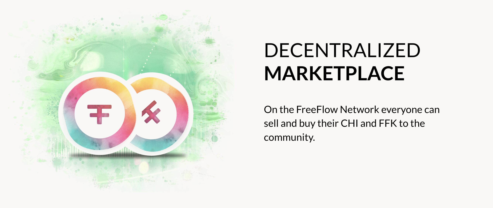

# Marketplace

  

There is a DEFI and Auction system build into the FreeFlow Chain which allows everyone to buy and sell their CHI and FFKs.

## DEFI

- Liquidity pool assets provided in CHI, FFK's, TFT and chosen stable coin e.g. USDC.
- The liquidity pool is managed by a DAO and the Buy/Sales prices and used DEFI algoritmes for the different currency pairs are defined on regular basis.
- The difference between sales and buy is called the spread and is 100% to the benefit to the Liquidity Pool providers, this means it can be very rewarding to provide liquidity to such a pool.
- At start the DEFI system is very simple and will mainly be geared towards people buying their CHI's.
- Everyone (also the FF Treasury) can withdraw and fund their assets (digital currencies or tokens) to the pool.
- The pool is a very fair mechanism (more fair compared to the current AMM based liquidity pools in our opinion). The prices and used algorithm are always known in advance and everyone can go in/out whenever they want. Their reward is always in line to their participation per every transction which happened at that specific time.

## Auction System (Q2 2023)

- once every period (probably every week or 2 weeks), people can leave their bids with the Auction system.
- the auction system will use pre-defined rules how the exchanges will happen. A possible algorithm could be Dutch auction but its possible that other algoritmes can be implemented as well.

## FFChain does not support AMM or Orderbook Based Trading.

We believe above methods are more safe and fair for all participants in the FreeFlow Ecosystem as such we did not chose yet to support AMM (Automatic MarketMaking) or OrderBook based trading as typically found on many blockchains.

We chose to disadvantage liquidity in line to valuation protection as we believe longer term this is more beneficial for everyone involved.

Ofcourse we are a decentralized organization and as such we might together define to change these rules.

