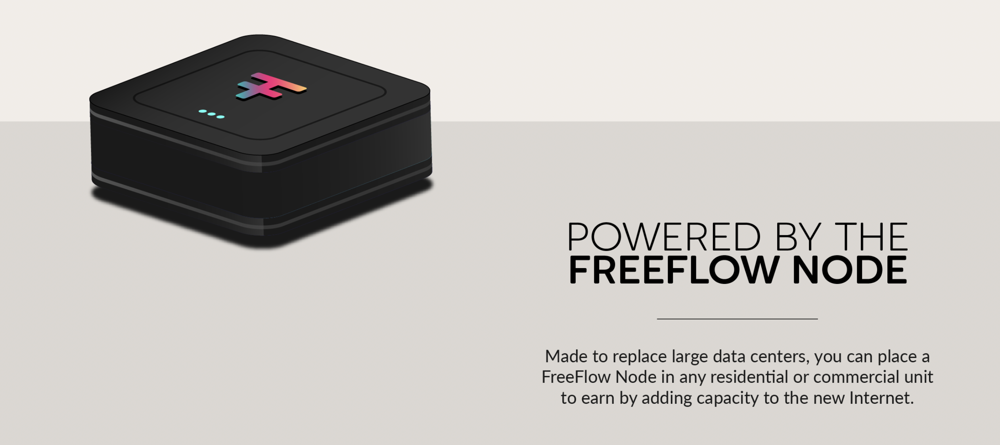

# Get Rewards

  

> TODO: get content from threefold, basic rewards see in farming_intro

# PoC Rewards

| Percentage | Description             | Remark                                                       |
| ---------- | ----------------------- | ------------------------------------------------------------ |
| 90%        | go to Farmer            | for rewarding the costs of the investments and power         |
| 10%        | go to FreeFlow Treasury | for further developmen and promoting of the FreeFlow network |

- Additional [TFT](/tfgrid/farming/threefold__threefold_token) are farmed to compensate for Carbon and deliver the yield for the Layer 2 Staking pools

## Farming Reward Calculation

Each FreeFlow node has a certain amount of compute, storage and network resources, the reward is calculated as such:

- Compute Capacity (CPU)
- Memory Capacity (RAM)
- Storage Capacity (SSD/HDD)
- Network Capacity (Bandwidth, IP Addresses)
 
> TFT earned per month = 
    CU farmed * CU farming rewards 
    + SU farmed * SU farming rewards
    + NU used * NU farming rewards
    + IPAddr used * IPAddr farming rewards

For the predefined nodes as defined on the "buy node" page the rewards are fixed and desribed in this manual.

{{#include ../buy/disclaimer.md}}