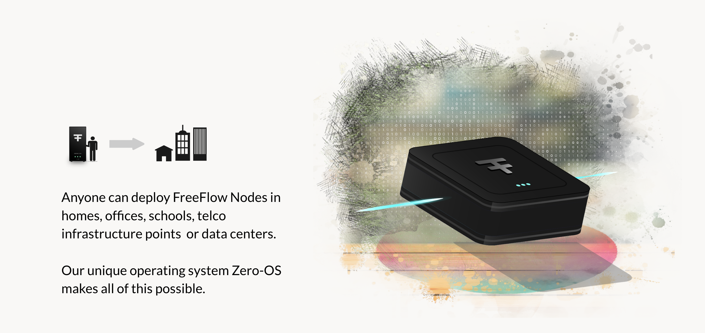

# I want to farm

  

Farming means you buy  a freeflow node and you host this node in your home or any other location of your chose. 

Each node produces internet capacity for the people around you, which allows them to host their digital life on your box.

  

By owning a FreeFlow node you will be rewarded in CHI.

### Cost Of Farming

Anyone can become a Farmer, and there is no technical knowledge required. FreeFlow uses ThreeFold’s autonomous system which does all the heavy lifting, making it easy for anyone to join (learn more in https://www.threefold.io/).

Costs to provide Internet capacity to allow FreeFlow twins to be hosted:

- The computer and storage hardware required (see our nodes)
- Electrical costs to power the farm.
- Potential cost of equipment to support larger farming setups such as data centers (ventilation, monitoring, electrical wiring, etc).

{{#include ../buy/disclaimer.md}}