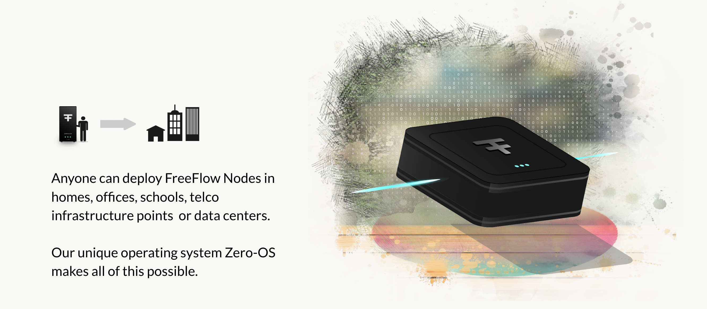

# Get Farming Rewards

  

The described Gold and Silver FreeFlow nodes are the only mechanism the farm CHI (creation of CHI by the blockchain).

| Reward  | FF Node Type               | Remark                                                        |
| ------- | -------------------------- | ------------------------------------------------------------- |
| 300 CHI | Silver FF Node Base        | for rewarding the costs of the investments and power          |
| 500 CHI | Gold FF Node Base          | for rewarding the costs of the investments and power          |
| 150 CHI | 20 FF Twins Hosted on Node | booster for your node is actively used                        |
| 300 CHI | 50 FF Twins Hosted on Node | booster for your node is actively used                        |
| 200 CHI | network quality booster    | fast internet connectivity (fiber) and at least 10 IP address |
| 200 CHI | uptime booster             | last 6 months no downtime on node, less than 0.5% on network  |

- CHI is pegged to the USD at $0.1 in above table, if CHI/USD changes so will table above.
- The rewards are 90% for the farmer 10% for the FreeFlow Treasury.
- The base fee is locked in into the FF Chain (pegged to USD) and stays valid for 60 months.
- The rewards do only unlock after 6 months and are lost if machine gets removed from network.

| Percentage | Description             | Remark                                                       |
| ---------- | ----------------------- | ------------------------------------------------------------ |
| 90%        | go to Farmer            | for rewarding the costs of the investments and power         |
| 10%        | go to FreeFlow Treasury | for further development and promoting of the FreeFlow network |

(*) ThreeFold (the company who created the technology for the network and technology making freeflow possible) can also sell certified nodes for the usecase of FreeFlow).

{{#include ../buy/disclaimer.md}}
