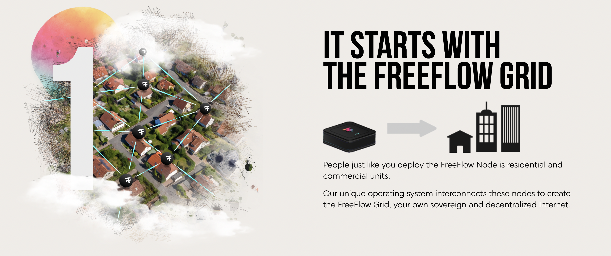

# Buy a Freeflow Node

  

> Only 5.000 FreeFlow nodes will be sold at conditions as mentioned below. After these first 5.000 the farming reward will be much lower.

## FreeFlow Node Silver

This is a node enough to host the digital life of about 30 people

> COMMERCIALS
> 
> - 999,- USD (without transport costs)
> - reward: 
>     - 300 CHI per month during 5 years
>     - upto 500 CHI boosters for achievements accomplished  see in farming reward section.

Only limited amount of nodes will be sold using above commercials, make sure to do your pre-purchase online soon.

> TECH SPECS
>
> - 12 logical cpu cores
> - 32 GB (memory)
> - 1TB SSD (fast storage)
> - 40 watt power utilization

## FreeFlow Node Gold

This is a node enough to host the digital life of about 50 people with more storage.

> COMMERCIALS
>
> - 1599,- USD (without transport costs)
> - reward: 
>     - 500 CHI per month during 5 years
>     - upto 500 CHI boosters for achievements accomplished  see in farming reward section.

Only limited amount of nodes will be sold using above commercials, make sure to do your pre-purchase online soon.

> TECH SPECS
>
> - 16 logical cpu cores
> - 64 GB (memory)
> - 2TB SSD (fast storage)
> - 8 TB HD
> - 60 watt power utilization

{{#include ../buy/disclaimer.md}}