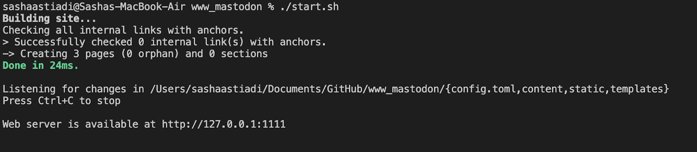

#  Build and Preview your website locally

After customizing your website, you might want to review and build your website locally before publishing it online. On this page you will find tutorials on how to preview and deploy your website.

To preview your website locally, simply open the terminal via your code editor and type in:

```
./build.sh
```

So that the framework starts building your website.

Then

```
./start.sh
```

So that the framework starts serving your website preview locally. Please make sure you are on located on the right website folder, for example: *$ user/doc/mywebsitename* before typing the command above. 
 
 The preview won't successfuly be built if you run the command in the wrong folder.

When successful, it will give you a link to a local preview of your website. Go ahead and copy paste the url onto your web browser to preview your website locally.



And, Congratulations! You just built your website locally!


## Important Links

> - [Command Line Cheat Sheet](https://cs.colby.edu/maxwell/courses/tutorials/terminal/)

