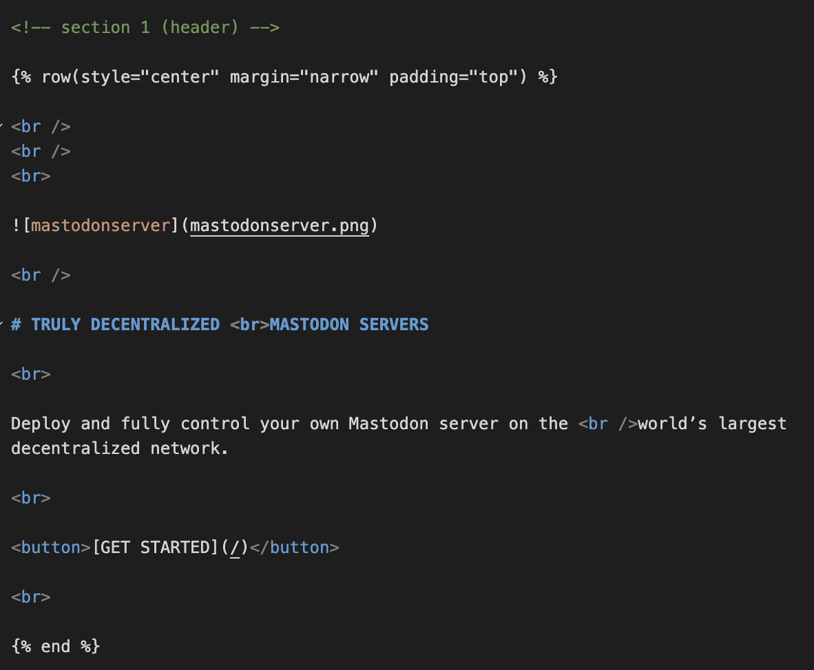

# Customization

We have designed the template in certain ways that it would accommodate different indentation web page style, such as placeholders, footer, header, left-indentation, right-indentation.

All you need to do is just replace the texts and images using markdown language, and use the indentation style you would like to use for your page. Don’t know how to markdown? Here’s a [**complete markdown syntax guide**](https://www.markdownguide.org/basic-syntax/) for you to begin with.

For example, the first section of the homepage of [**www.mastodon.io**](www.mastodon.io)

In Markdown:

## Important Links
> - [Learn Markdown Language](https://www.markdownguide.org/)
