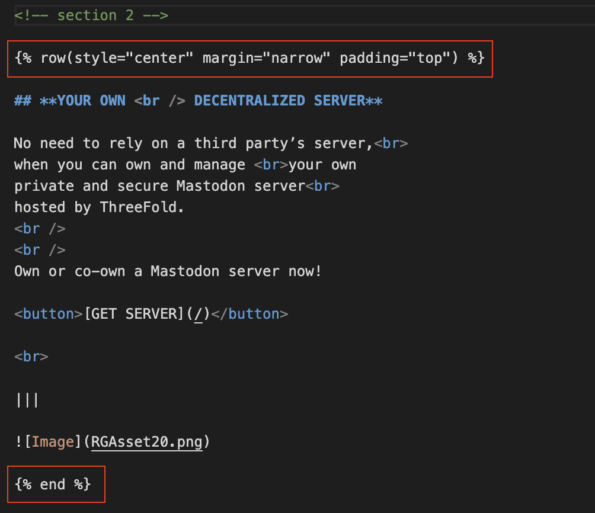
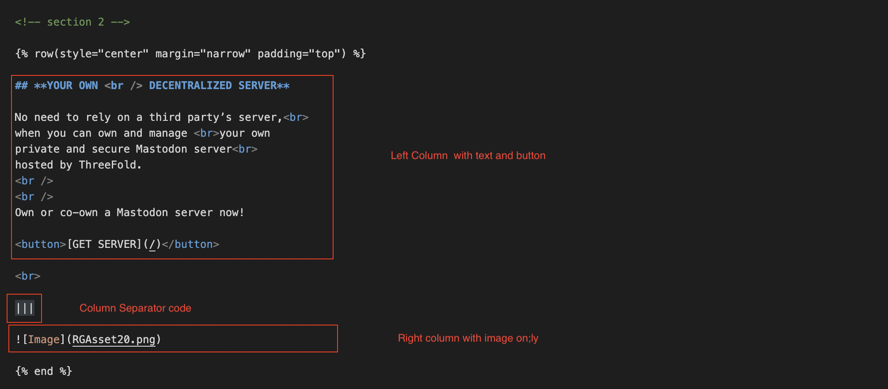
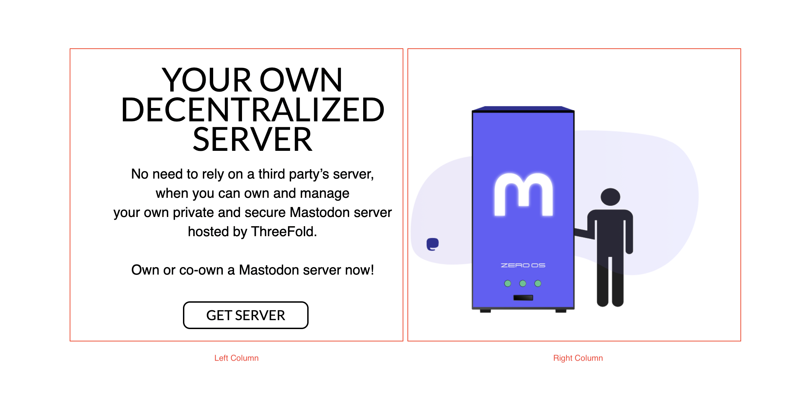
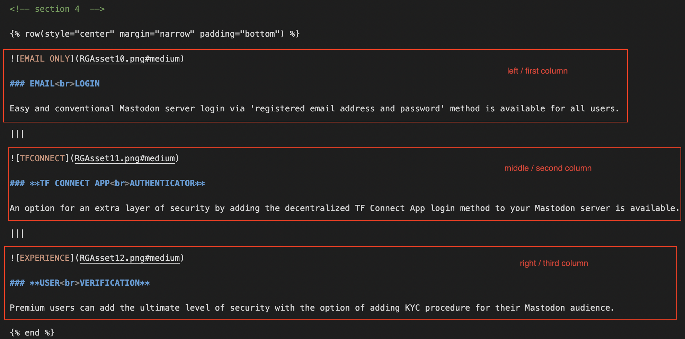

# Customization

We have designed the template in certain ways that it would accommodate different indentation web page style, such as placeholders, footer, header, left-indentation, right-indentation.

All you need to do is just replace the texts and images using markdown language, and use the indentation style you would like to use for your page. Don’t know how to markdown? Here’s a [**complete markdown syntax guide**](https://www.markdownguide.org/basic-syntax/) for you to begin with.

 Happy experimenting!

## Some Tutorials on Markdown

### Creating A single-column Page Section

Since we only have one column, Every one column section begins only with row indentation syntax (style, margin, padding).


```
<!-- section 1 (header) -->


```

for example:

```
<!-- section 1 (header) -->


```

and ends with 

```

```

For example, the first section of the homepage of [**www.mastodon.io**](www.mastodon.io) in Markdown:




### Adding Image

To add image to your page please use 

```

```

The Result:


### Creating Page Section with Multiple Columns

For more than one column section, we need to configure the row and column syntax.
For example:
Sometimes you would like to have a page where you place your texts and buttons on left column and an image on the right column, like:

What you need to do is add:

```
|||
```
in between your text and images for every column you want to create.

For example, this page consist of two columns (left and right):



The Result:



You can add more than two column like this one, a page section consist of 3 columns.

The code:



The Result:


## Important Links
> - [Learn Markdown Language](https://www.markdownguide.org/)
