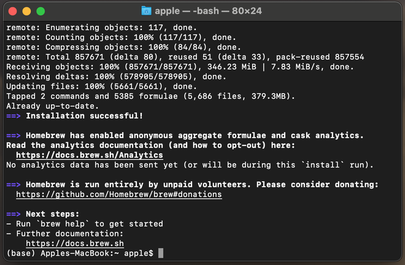
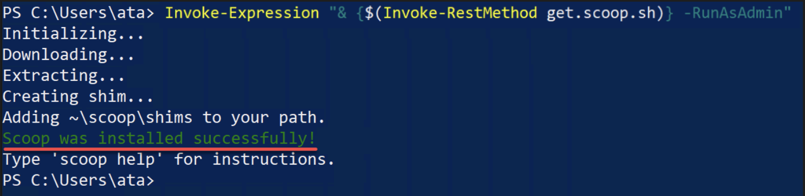

# Installing Zola onto Your Machine

To install Zola on your machine, simply go to your terminal and run the following command:

**MacOS (brew)**:

```
$ brew install zola
```
Please make sure you have [Brew](https://brew.sh/) installed on your MacOS machine before installing Zola. 

You should see a similar screen as below when successful:



<b>Windows (scoop)</b>:

```
$ scoop install zola
```
Please make sure you have [Scoop](https://scoop.sh/) installed on your Windows machine before installing Zola.

You should see a similar screen as below when successful:



For more details on Zola Installation, and installation guidelines for other operating systems, please read: [**Zola Installation Manual**](https://www.getzola.org/documentation/getting-started/installation/).


## Important Links
> - [How to Install Brew (MacOS)](https://brew.sh/)
> - [How to Install Scoop (Windows)](https://github.com/ScoopInstaller/Scoop#readme)
> - [Zola Installation for other OS](https://www.getzola.org/documentation/getting-started/installation/)
> - [Command Line Cheat Sheet](https://cs.colby.edu/maxwell/courses/tutorials/terminal/)