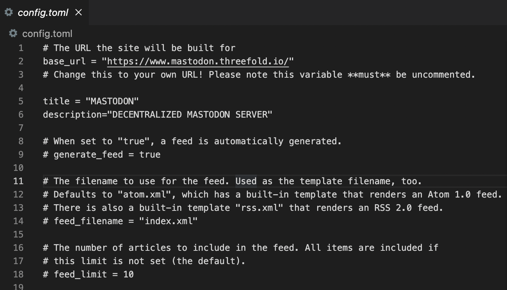
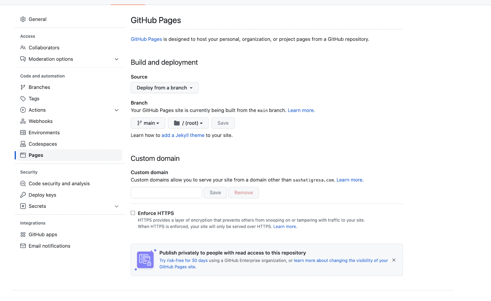
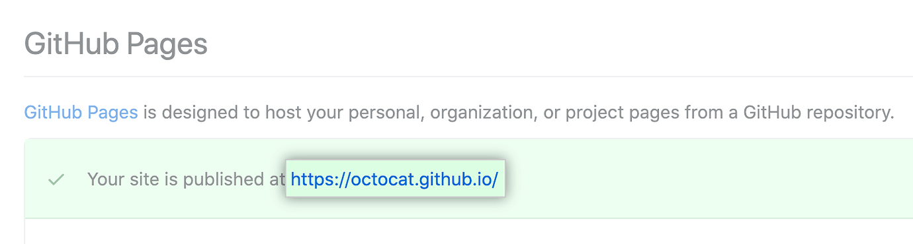

# Publish Your Website (Via Github Pages)

Since we're using github repository to save our website content, the easiest way to publish our website is also through github pages and by using our own domain.

Once all commits have been pushed back to your github repository online, you can start publishing your website.

The first thing you need to do is to go back to your code editor, and find **config.toml** file on your website repo. 
Edit the **base_url** on the **config.toml** file on your repo to your own domain.

Save all your changes and push all your commits to its origin again.

## Publish your Github page

Later on, go to your github repo **settings**, go to **Pages** on the left navigation sidebar. Add your own custom domain to start publishing your website.

And you are done! Your website will be published, and it will take only a minute or so to complete the process. Refresh page, and you will see a link to your newly published website.

## Important Links
> - [Pushing Changes to Github](https://docs.github.com/en/desktop/contributing-and-collaborating-using-github-desktop/making-changes-in-a-branch/pushing-changes-to-github)
> - [Github Pages How-to](https://docs.github.com/en/pages)
> - [Adding Custom Domain to my Github Page](https://docs.github.com/en/pages/configuring-a-custom-domain-for-your-github-pages-site/about-custom-domains-and-github-pages)
