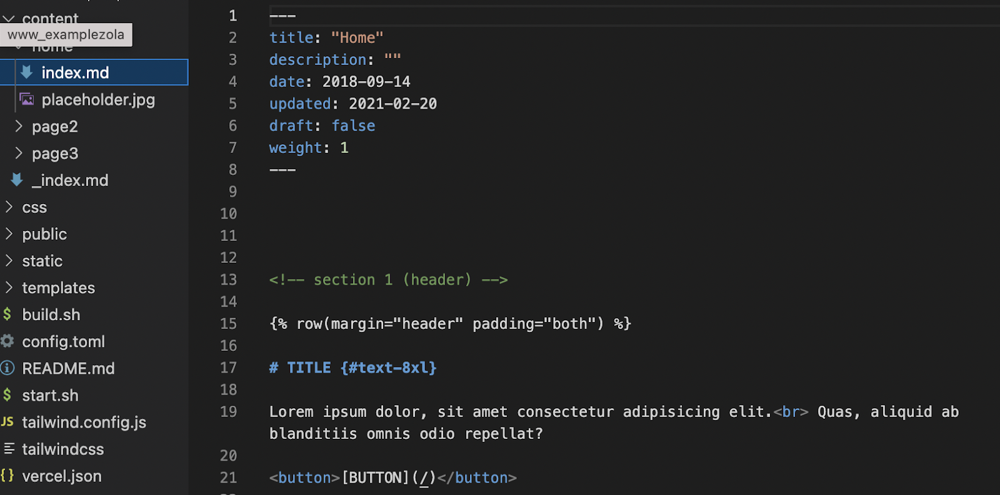

# Template Guide

On this page you will find an introduction on [TF Web Template](https://github.com/threefoldfoundation/www_examplezola) and how to navigate the different template component that enable you to edit the template with your own content.

## Navigating the Template

Each editable page would be found under **‘content’** folder. 
<br>
Each subfolder under ‘content’ represent a single individual page. 
<br>
Each subfolder will consit of: **image files** that will be displayed for the page, and an **index.md file**.
<br>
**Index.md** the file where you can replace the template content with your own website content. 


<br>

For example, if I want to edit the homepage of my website, I would go to the following:

```
content/home/index.md
```
 and start editing.

 ## Navbar made easy


When you make a new page subfolder, we have designed it in a way that the website would automatically generate a new navbar item using the name of each folder you created.

 based on the navbar picture above, it means that I have created 3 separate content subfolders, each with an index.md file on it called Home, ThreeFoldFeed and Getserver.

## Replace Logo with your Own logo


To replace the logo, **add your own logo image to ‘home’ folder.**

And then go to **_index.md** file and replace the **logo_path**: images/yourlogoimagename.jpg

## Important Links

> - [TF Web Template](https://github.com/threefoldfoundation/www_examplezola)

