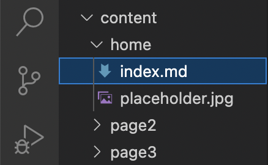
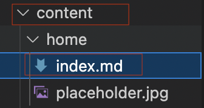
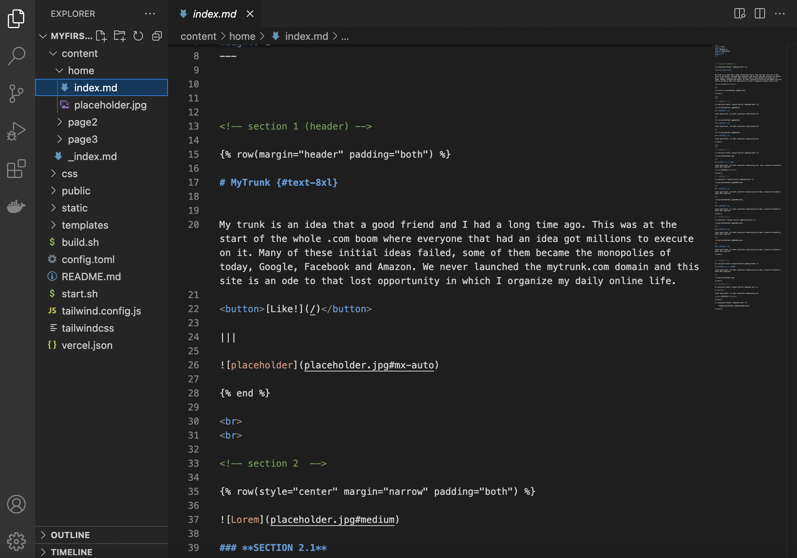
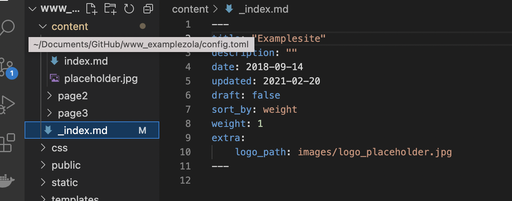
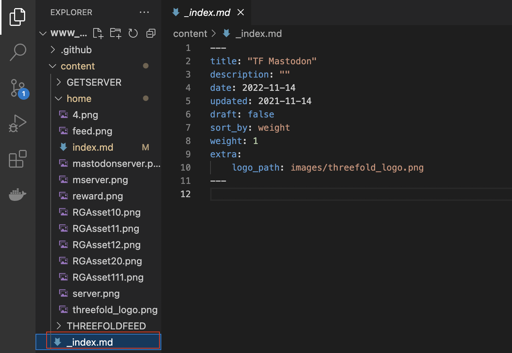

# Template Guide

On this page you will find an introduction on [TF Web Template](https://github.com/threefoldfoundation/www_examplezola) and how to navigate the different template component that enable you to edit the template with your own content.

## Navigating the Template

All editable content of your website would be found under **‘content’** folder. 
Each page of your website is a **markdown (.md) file.**

Each page and all the images on the page will be put into its own folder under content/ folder. 

<br>
For example, here, my homepage (index.md) is put into **content/home** folder.


If I want to edit the homepage of my website, I would go to the following:
bb
```
content/home/index.md
```
 and start editing.

 

 ## Top Navbar Made Easy


Every time you make a new page folder, we have designed it in a way that the website would automatically generate a new navbar item using the name of each folder you created.

 based on the navbar picture above, it means that I have created 3 separate content subfolders, each with an index.md file on it called Home, ThreeFoldFeed and GetServer.

## Replace Logo with your Own logo


To replace the logo, **add your own logo image to ‘home’ folder.**

And then go to **_index.md** file and replace the **logo_path**: images/yourlogoimagename.jpg



## Important Links

> - [TF Web Template](https://github.com/threefoldfoundation/www_examplezola)

