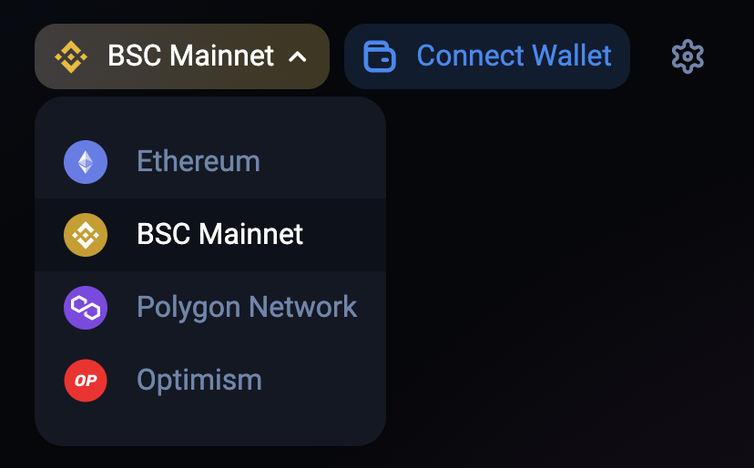

# What is [1inch.io](http://1inch.io/)?

The [1inch Network](http://1inch.io/) unites decentralized protocols whose synergy enables the most lucrative, fastest, and protected operations in the DeFi space. It acts as both Liquidity Protocol and Aggregation Protocol. Essentially, 1inch connects many third party DEXes and has its own liquidity pools as well, to provide the best possible pricing for the end users. It is an easy entry to the DeFi space.

For more details about 1inch you can find a [review of the 1inch exchange here](https://www.coinbureau.com/review/1inch-exchange/).

# How to get TFT on 1inch

1. First, head to  [1inch.io](http://1inch.io/).

2. You’ll need to connect a wallet to the 1inch dApp. Click ‘Launch dApp’ in the top-right corner, and then find ‘Connect Wallet.’ For this, you should have a wallet configured for Binance Smart Chain (BSC), either via [MetaMask](tft_bsc_metamask) (browser extension and mobile app) or any other supported wallet from the list where you store your TFT on BSC. MetaMask is quite a popular wallet and we already have a tutorial on our wiki, which is why we recommend it. If you have MetaMask installed as a browser extension, you will see it as an option in the list. If not, you should see ‘Web3’ (for us, it’s the second option), which will then point you to MetaMask.

* Instructions to set up [Metamask for BSC: here](tft_bsc_metamask)
* For other wallets in the list please refer to the respective wallet’s manual.

3. You will first need BNB in that wallet to cover transaction fees. Low amounts are sufficient, as the average transaction on BSC does not exceed 1-2 USD.

4. Go to the [1Inch DAPP](https://app.1inch.io/) website 1 and switch to BSC Mainnet in the network selector in the top right corner:

5. Click on the 1INCH token under “To (estimated)” to open a drop-down list, and find [TFT on BSC](https://app.1inch.io/#/56/swap/BNB/TFT). Note you can swap from any supported token but you will still need BNB for transaction fees.

6. Click “Connect Wallet” and select your wallet to connect with.

7. Click “Give permission to swap.” This [“approval” transaction](https://help.1inch.io/en/articles/4585113-why-do-i-need-to-approve-my-tokens-before-a-trade) is step 1 of 2 for swapping, and costs a small gas fee. It only gives permission, and is not the actual swap.

8. Adjust slippage tolerance, gas price, or enable the ‘partial fill’ in the settings if needed.

9. Hit the ‘swap token’ button and confirm the transaction in your wallet.

10. Wait for the banner in the upper-right corner informing you about the success of your transaction.

Congrats! You have just completed a swap.

