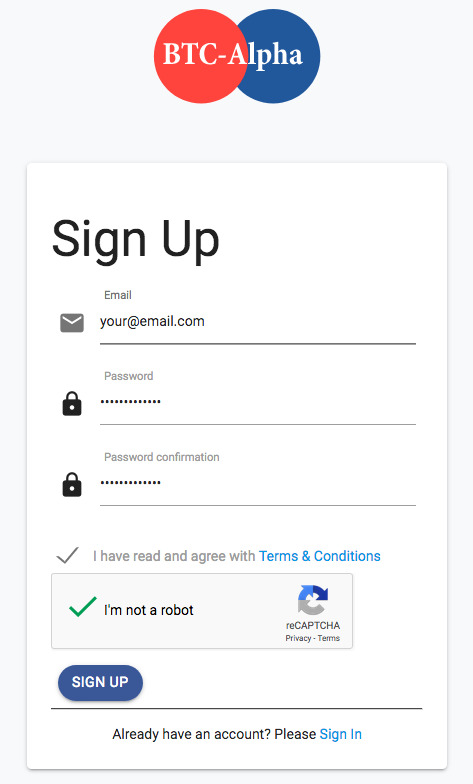
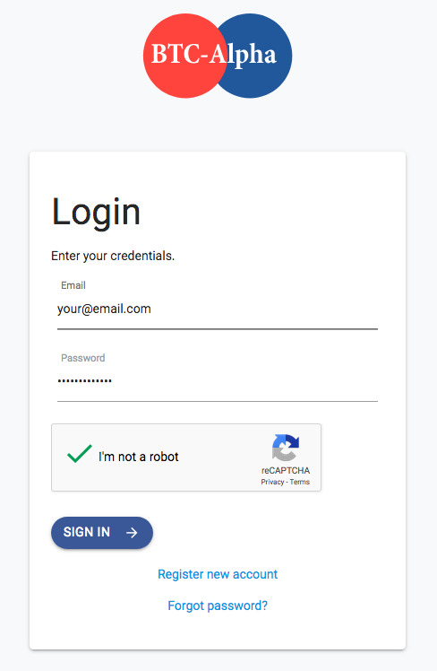

# Buy from BTC-Alpha

BTC-Alpha was the first cryptocurrency exchange to support ThreeFold_Tokens (TFT).

### How to Register

Registration to the [BTC-Alpha](http://btc-alpha.com) exchange is simple, you only need to provide your email address and a password, so no complex verification procedures required.

To register, go to their [Sign Up](https://btc-alpha.com/accounts/register) page:

After registration, you will receive an email with an email verification link.

### Log In

Once you've finished registration, log in to your account using your email address and password.

Note that you may be asked to enter a 6-digit code sent to your email the first time you log in from a new device.

### Verify your identity

In the menu underneath your name, you'll see an option for [verification](https://btc-alpha.com/en/profile/verification).

You've already passed email verification (level 0) but there are three more levels of verification possible which we would recommend [from both a security standpoint as well as a functionality standpoint](https://medium.com/@BTCAlpha/how-and-why-to-undergo-the-kyc-procedure-29f3b40af80).

1. Personal Information
2. Identity
3. Addresses

The flow is quite easy to follow. If you're having trouble, you can easily find [BTC-Alpha Support](https://btc-alpha.com/en/support) through Zendesk, Email, Telegram, & more.

### Enable two-factor authentication

From a security standpoint, it is highly recommended to enable two-factor authentication (2FA) for your BTC-Alpha account.

To do that, first install **Authy** or **Google Authenticator** on your mobile phone:

- [Authy](https://authy.com/download/)
- [Google Authenticator: Google Play](https://play.google.com/store/apps/details?id=com.google.android.apps.authenticator2&hl=en)
- [Google Authenticator: Apple](https://itunes.apple.com/ae/app/google-authenticator/id388497605?mt=8)

Then, click under your name (top-right), then "Enable Two-factor Authentication," and go through the process there.

> It is not recommended to keep your funds permanently on a public exchange or use a public exchange as a wallet, because exchanges are more likely to be hacked than your personal wallet.

### Start trading!

1. First, you'll need to [deposit funds](https://btc-alpha.com/en/profile/wallets) into your account
   - You can buy crypto directly using your bank card (after passing verification) [here](https://btc-alpha.com/en/mercuryo)
   - **If you need help, you can find it [here](https://btc-alpha.zendesk.com/hc/en-us/articles/360001896052-How-to-deposit-funds-into-my-private-account-in-the-exchange-market-)**
2. Then, you will need to exchange your deposited fiat or cryptocurrency into BTC (Bitcoin)
   - This is currently the only trading pair available with TFT
   - A trading pair is basically a currency which can be used to exchange or trade with another currency
   - **If you need help, you can find it [here](https://btc-alpha.zendesk.com/hc/en-us/articles/360001922531-How-can-I-carry-out-trading-in-the-BTC-Alpha-exchange-market-)**
3. Now you can start buying TFT
   - To trade BTC, click [here](https://btc-alpha.com/en/exchange/TFT_BTC)

!!!include:legal:tft_not_investment