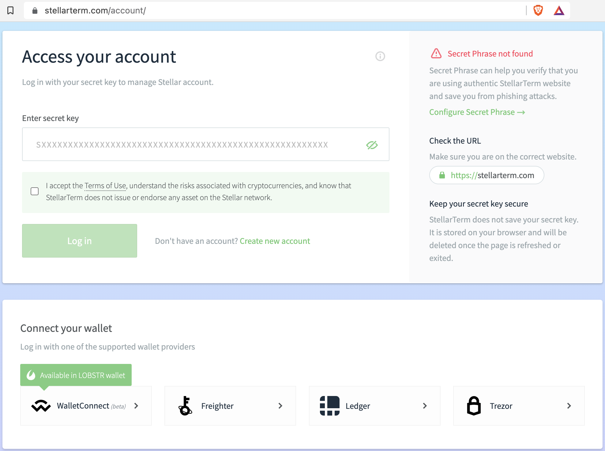
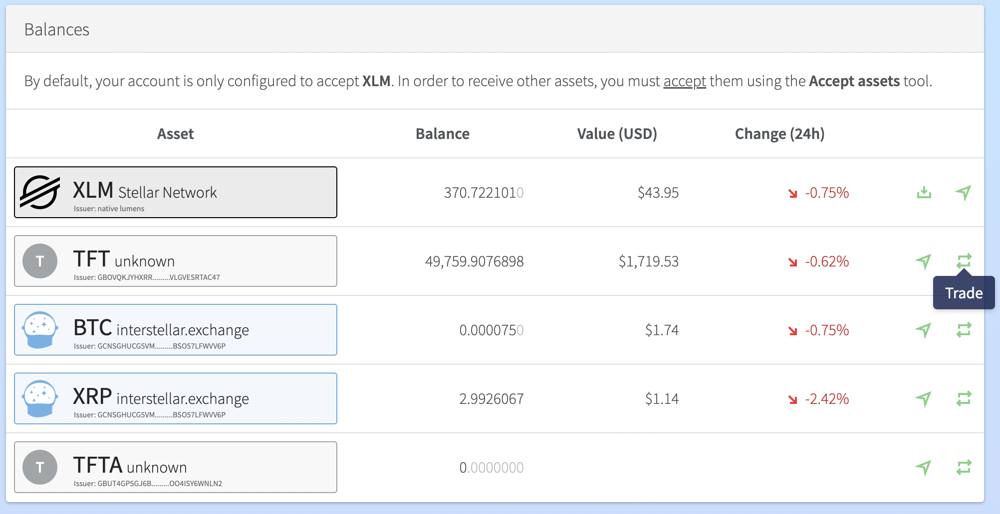
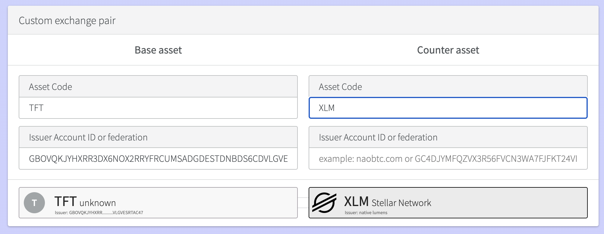
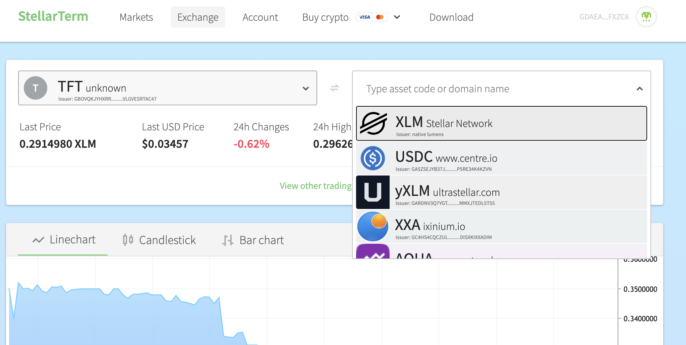
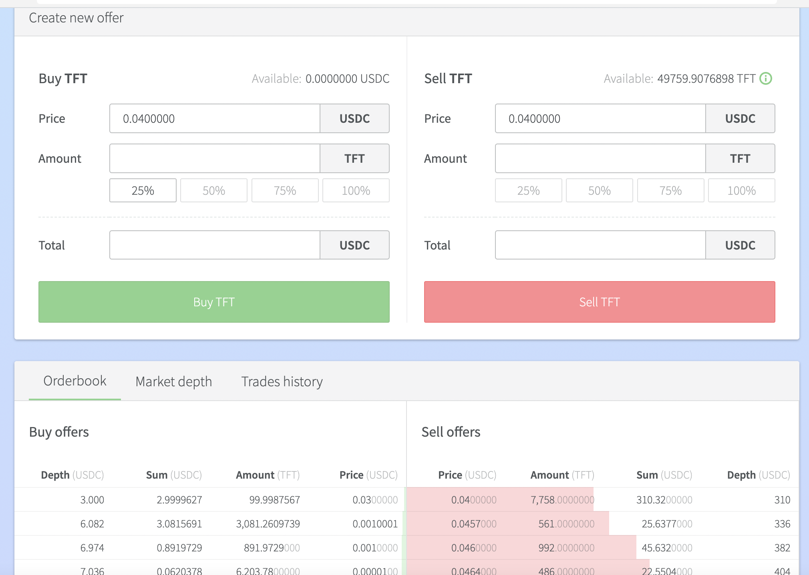

# What is StellarTerm?

[StellarTerm](https://stellarterm.com/) is an open source client for the Stellar network that allows people to trade on the Stellar Decentralized Exchange. Users can send, receive, and trade assets on the Stellar network easily with StellarTerm.

# How to use StellarTerm

Since StellarTerm is an open source UI on top of Stellar DecentraliZed Exchange, you can just log in there using your existing Stellar wallet.

StellarTerm is directly compatible with [Freighter wallet](https://www.freighter.app/) and the mobile version of the [Lobstr wallet](lobstr_wallet). Also it is possible to log in using your secret key exported from any other wallet (although this option is less secure). To open StellarTerm with an existing wallet, just click **LOGIN** in the top right corner and select your suitable option.

If you do not have any wallets yet, you will have to create a new wallet by clicking the **NEW ACCOUNT** option, but you will have to [fund it first](coinbase_fiat) with some XLM (Stellar Lumens) and activate TFT token in your wallet (add a trustline). 

After logging in, if you already have TFT in your wallet, just click on the Trade button next to it on the balance screen that you will see right after login:

If you do not have TFT in your wallet yet, go to the Markets page and scroll to the very bottom, find "Custom Exchange Pair" dialog and fill in the Base Asset field: 

- Asset Code: TFT
- Issuer Account ID or federation: GBOVQKJYHXRR3DX6NOX2RRYFRCUMSADGDESTDNBDS6CDVLGVESRTAC47

Select USDC or XLM or any other asset as Counter Asset and click to pair.

When you are on a trade page, you can select any other Counter Asset.

And then you just pick the order or create a new one the same way as on any other exchange.

