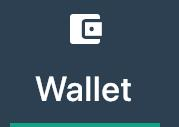
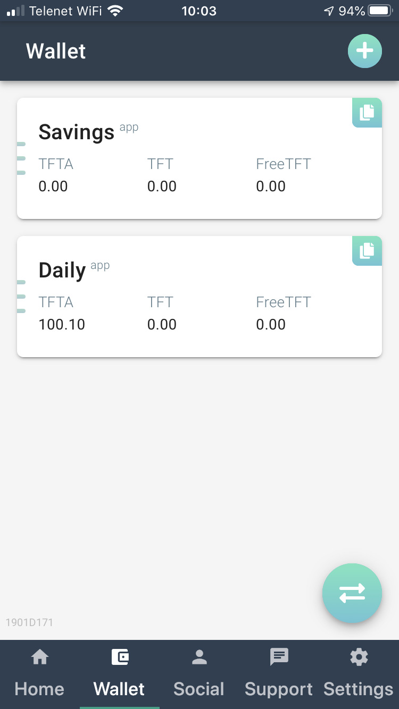

# Convert TFT to the Stellar Blockchain in the ThreeFold Connect App

This document helps you to convert your TFT from ThreeFold's proprietary Rivine blockchain to the Stellar blockchain. Depending on your current situation you have to do either one or two steps to complete this conversion.

## Step 1: You have not updated to ThreeFold Connect and are still using the old TF App as a wallet

You have not moved from the TF App to ThreeFold Connect. Please follow the steps in the slides below to migrate from TF App to the ThreeFold Connect app.

<iframe src="https://docs.google.com/presentation/d/1IwcGyf6SGOsbXWVraU1OzWUX_O5W4nHobkKxkqs1ryg/embed?start=false&loop=false&delayms=10000" frameborder="0" width="750" height="470" allowfullscreen="true" mozallowfullscreen="true" webkitallowfullscreen="true"></iframe>

Congratulations, you successfully migrated your wallet(s) to the ThreeFold Connect app. Now you have only one more step to finish. 

Please continue with Step 2.

## Step 2: You already have ThreeFold Connect, and your tokens are listed in the ThreeFold Connect App

As you've completed Step 1 (just now or a long time ago), we need you to go through the process listed below to move your tokens to the Stellar blockchain. This step is super simple. The migration process is built into the ThreeFold Connect app and only requires you to open it. The app on your phone grabs the updated software automatically and will convert the tokens for you. 

Depending on your token situation (farmer with lots of transactions, an investor with locked tokens, etc, etc) this process might take a while. This is normal, just let the process complete.

Let’s start the conversion process. It  is super simple:

- Close the ThreeFold Connect app on your smartphone
- Open it again by clicking the ThreeFold Connect icon
- Click on the Wallet tab below the screen

- Enter your PIN 

Et voila, the conversion process starts. As stated before, depending on your token situation this process might take a while.  **It is important not to close the app during conversion.**

Once the conversion process has ended, you will arrive in the accounts overview page. Done!

*Note that if you get an error message, please try again later before contacting support.*

- TFTA -> TFT: [See here for more info](tfta_to_tft)
