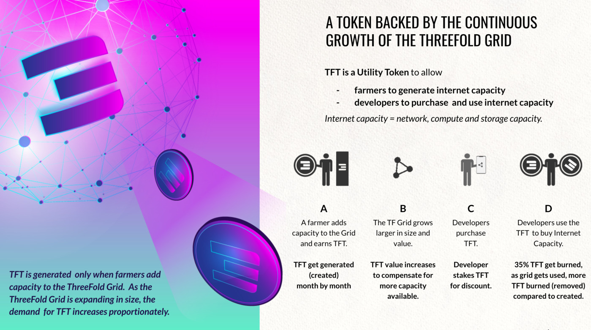

# Tokenomics Overview

## Proof of Capacity = Creation/Minting of TFTs

TFTs are rewarded when new capacity (storage & compute) is added to the ThreeFold_Grid in the form of hardware. 

[Farmers](farming_intro) farm (mine) capacity for the ThreeFold Grid. A TF Farmer is ThreeFolds more sustainable equivalent of cryptocurrency miners.

The amount of TFTs that are created by farmers depends on three variables:

1. Compute Capacity (CPU)
2. Memory Capacity (RAM)
3. Storage Capacity (SSD/HDD)

Learn more about the farming rewards [here](farming_reward).

Tokens are burned as result of utilization which leads to nr of tokens to be limited.

## Proof of Utilization

see [Utilization Token Flow](proof_of_utilization)

## Limited Supply & Liquidity Drivers

See [Limited Supply & Liquidity Drivers](tft_limited_supply)

## TF Grid is valuable

See [Valuable TF Grid](grid_valuation)

## Vesting

Many tokens are in vesting wallets see [Vesting](vesting_overview).

## Token Distribution

[Token Distribution](token_overview)

!!!include:token_toc