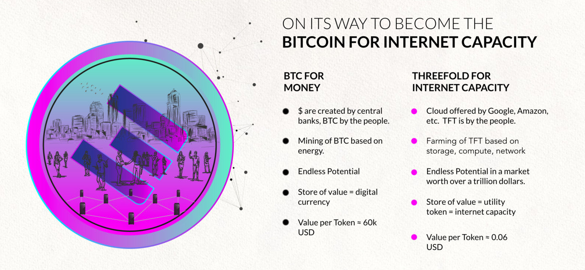
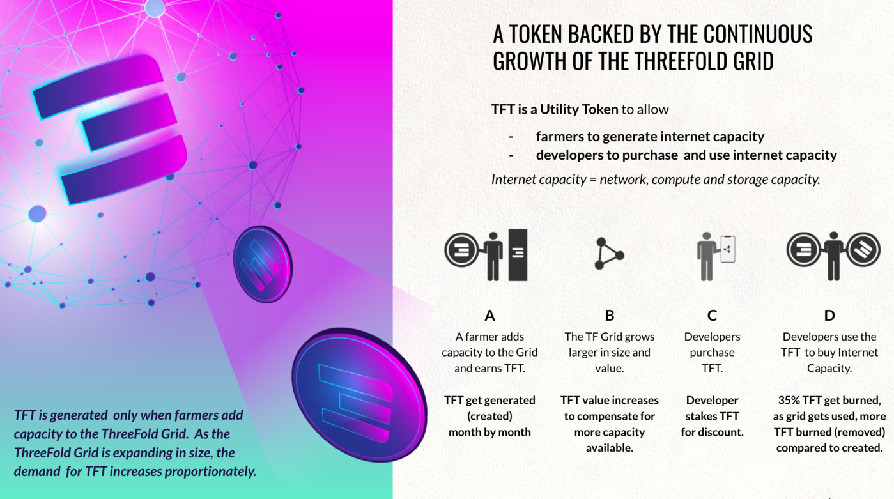

# Overview

Welcome to our knowledge base around the ThreeFold Token called TFT.

In this section, you will learn about what the token is, its features, tokenomics, how to buy, sell, store & more.

<!-- !!!include:token_toc -->

## Our Token TFT is a Valuable Token

ThreeFold_Token is the first utility token in the world that gives access to decentralized Internet (compute, storage and network) capacity. Users, Developers and enterprises use TFT to store data, build applications, and create peer-to-peer ecosystems on the ThreeFold Grid. 

The ThreeFold Grid is the driving force of the next evolution of the Internet as it enables tokenized economic interactions without intermediaries. It provides a unique set of data, a universal state layer, also referred to as the ledger, which is collectively managed by a network of trusted nodes. This unique state layer allows people to exchange information and value in a peer to peer (P2P) way.

