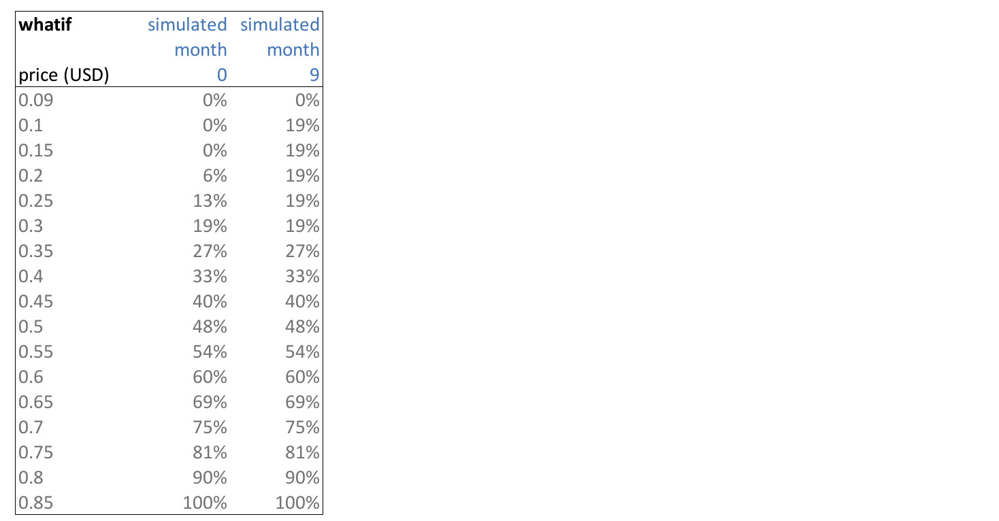

# Vesting Overview

Vesting is a voluntary mechanism introduced by ThreeFold in march 2021. It allows any ThreeFold token holder to put their tokens in a vesting pool on voluntary basis.

The tokens will gradually unlock over 48 months and there is an acceleration forseen if the price of the tokens goes up well.

> DISCLAIMER: This is a voluntary process. Each peron who choses to vest their tokens understands that this will get their tokens locked up. 

- [Vesting Pool](vesting_pool) - An introduction to how the vesting scheme is setup.
- [How To Vest](how_to_vest) - A quick and easy guide to vesting through the ThreeFold Connect app (more options coming soon).
- [TFGrid Concensus mechanism = blockchain](consensus3)
- [How Vesting Works](how_vesting_works) - Gives you insight to how vesting wallets work, how tokens are unlocked, and why multi-signature wallets are used.
- [How to do your own simulation](vesting_simulator_howto) - Shows you how to download the simulator yourself.

### A Quick Example 

The following table shows how vesting would work out on month 0 and month 9 in relation to the token price.

> Note our [disclaimers](legal:disclaimer)