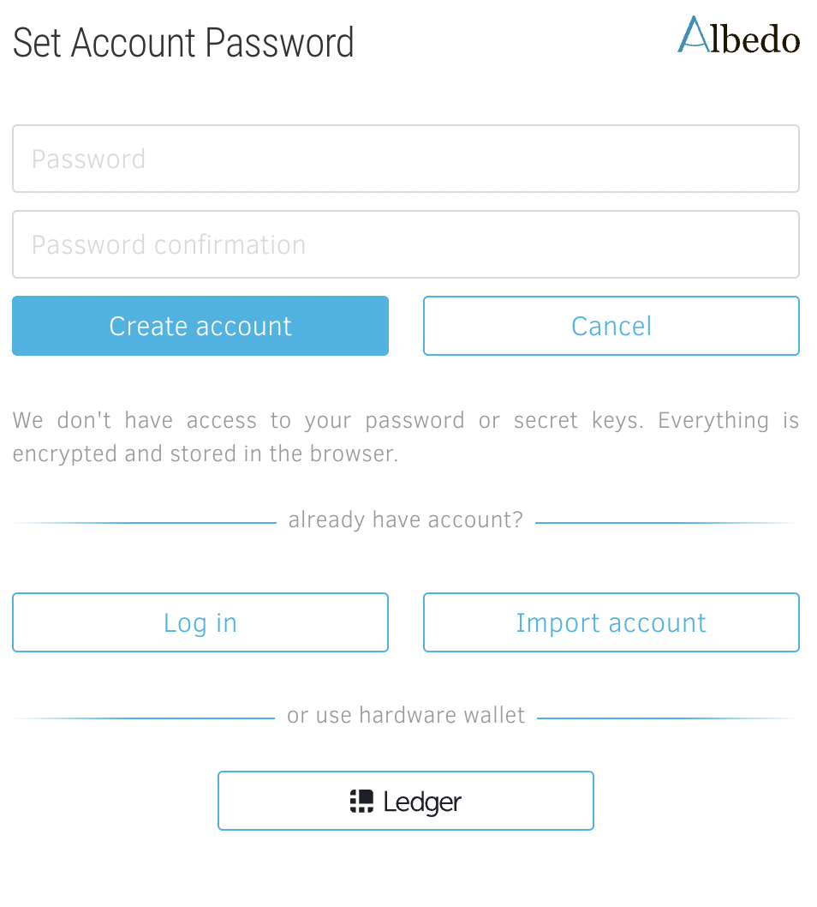
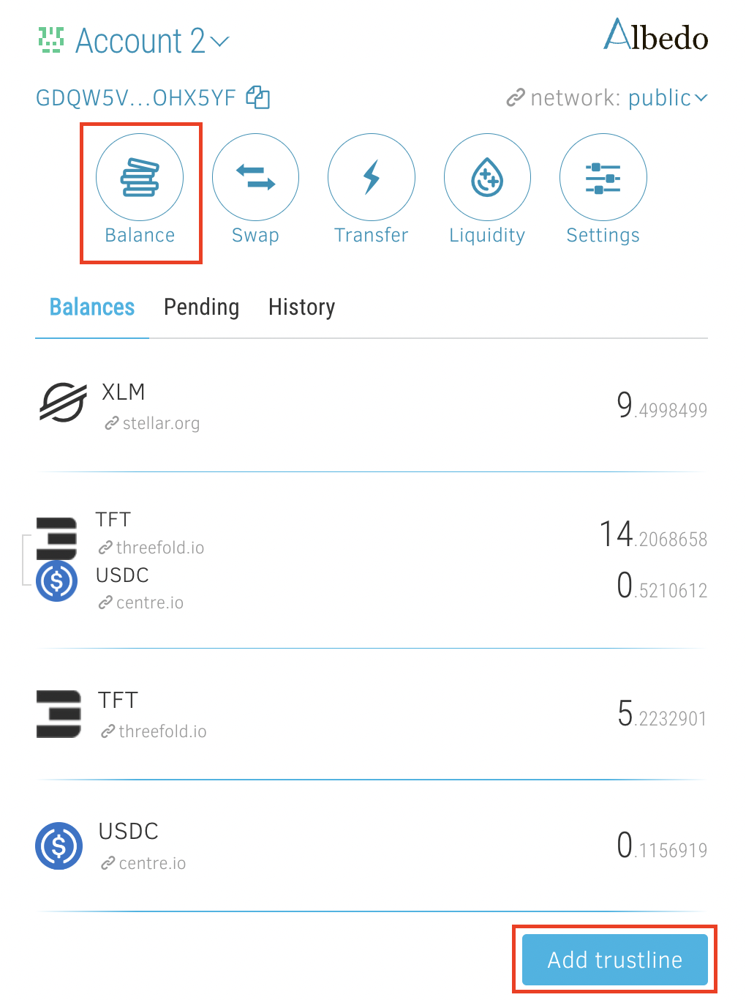
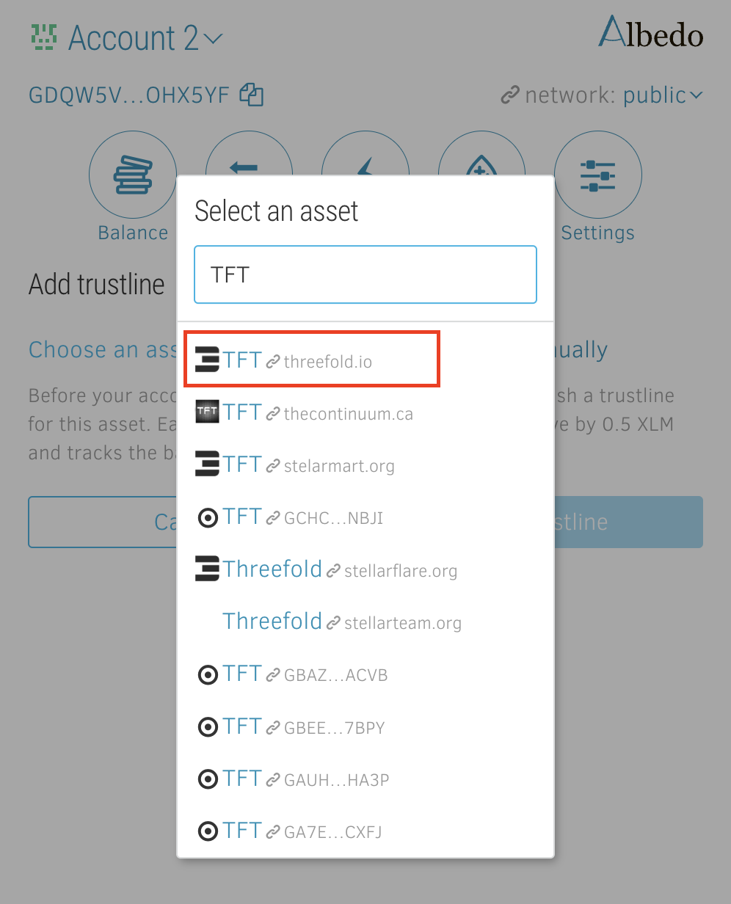
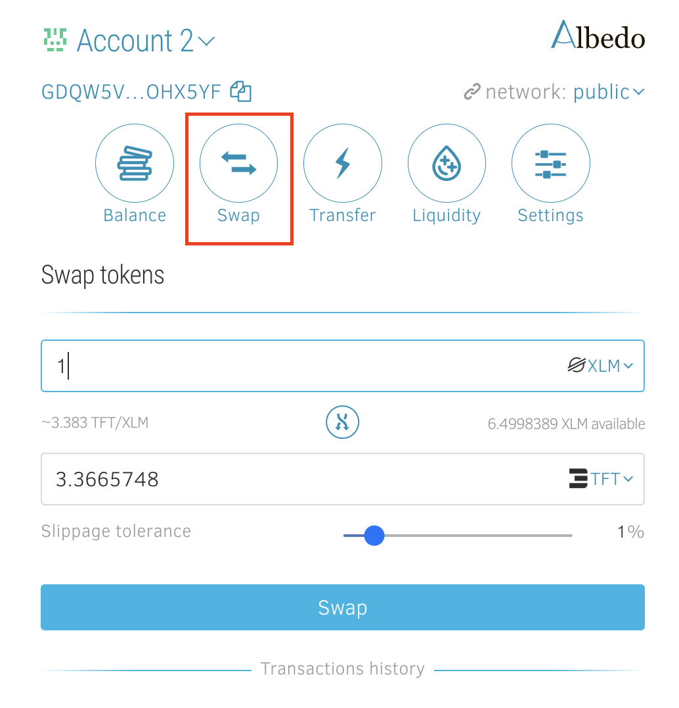
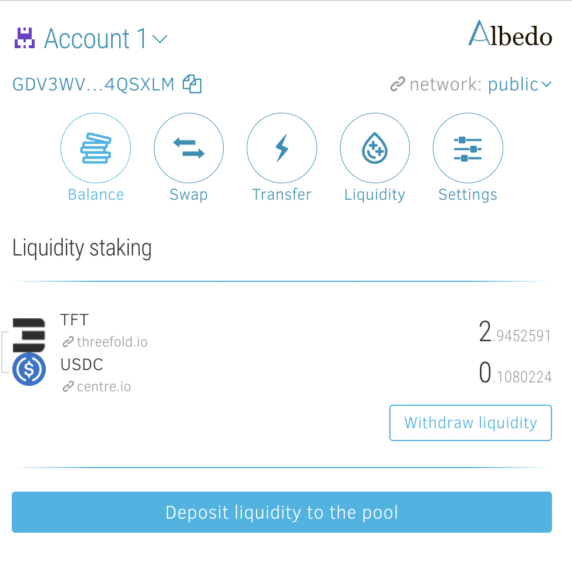

# [Albedo](https://albedo.link/)

Albedo provides a safe and reliable way to use your Stellar account without trusting anyone with a secret key. It is not a wallet. It's a keystore web app and browser extension (currently available for Chrome and Firefox ).

Albedo is an open-source browser-based (with browser add-on available) keystore web app and browser extension from the creators of [stellar.expert](https://stellar.expert/) explorer. It provides a safe and reliable way to use your Stellar account without trusting anyone with a secret key. Albedo supports storage, swaps and liqudity pools participation. You can use it directly from your [browser](https://albedo.link/) or install as a [browser add-on](https://albedo.link/install-extension).

## Create Account

You can create a new account or import a 24 word passphrase or secret key.

## Get TFT

If you do not have TFT yet, you can [buy it](how_to_buy) and deposit to your wallet. 

Alternatively, you can buy XLM or USDT first and then [swap to TFT inside Albedo](albedo?id=swap-assets).

## Send and Receive funds 

In order to recieve funds, you can copy your address as shown in the top left corner. Click on the "copy" button to copy it more easily.  In order to send funds, go to the Transfer dialog using the menu button and fill in the recipient address, amount, and currency (tokens) to send. 

## Activate TFT or other currency/tokens

Please keep in mind, that on the Stellar network you need to have some amount of XLM to cover transaction fees. Also, for any new asset you want to keep in your wallet, you have to add a trustline to it (to activate it).

To add a trustline, go to the "Balance" section, and click "Add trustline" button. 

Then, click on "choose asset" and type the asset name. In the case of TFT, please make sure you also see a threefold.io website name nearby, as there are some pretenders out there. If you have any uncertainties, please ask in the chats or on live support. 

## Swap assets

Albedo allows anybody to easily swap assets between each other, using the Stellar Decentralized Exchange (DEX) in the background. 

If you want to swap assets, go to the "Swap" section, choose your assets to swap between, and select the amount.

The exact price will be known only after the operation, so make sure that slippage tolerance is selected at the proper level for you. (Slippage refers to the difference between the expected price of a trade and the price at which the trade is actually executed.)

## Liquidity Pools

Albedo also allows anybody to join [Stellar DEX Liquidity Pools](https://developers.stellar.org/docs/glossary/liquidity-pool/). 

By joining the TFT Liqudity pool, you engage your funds in helping our community with liqudity, and earn transaction fees whenever an exchange happens for the specific pair. 

To participate in the liquidity pool, you have to provide in equal proportions two assets from both sides of the pair.

Click the button "Deposit Liquidity to the Pool" and then select the amount of the first or second asset you want to provide. Then click "Deposit". 

If you want to withdraw liquidity from the pool, click on the "Withdraw Liqudity" button near the liquidity pair and select the amount of the liquidity you want to withdraw.
