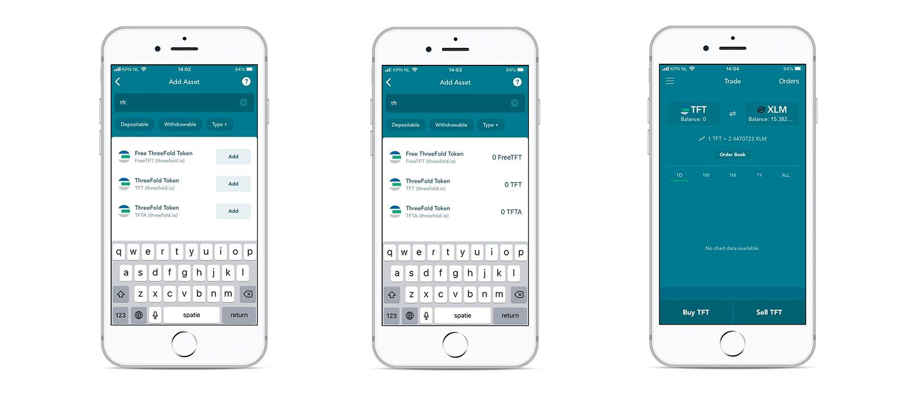

# Lobst Wallet

Simple & Secure Stellar Wallet

LOBSTR is a great way to get started with Stellar.

Simple, smooth and secure, it has all what it takes to manage your Lumens wisely. Besides managing you Lumens Lobstr also allows buying tokens with a Credit Card.

Lobstr is a simple and secure stellar wallet that allows you to buy TFT trading pairs with a credit card. Learn more about Lobstr [here](https://lobstr.co/).

### Create account

1. Go to https://lobstr.co/ and install on mobile, desktop or just signup in a web version. 
2. Download the application on the [App Store](https://apps.apple.com/us/app/lobstr-stellar-wallet/id1404357892) or [Google Play](https://play.google.com/store/apps/details?id=com.lobstr.client&hl=nl).
3. [Create your account in lobstr](https://lobstr.freshdesk.com/support/solutions/articles/151000001052-how-to-create-an-account-in-lobstr-).

### Fund your wallet

Lobstr allows you to buy XLM or USDC directly in your wallet. See their manual for details:
* [Buying crypto with LOBSTR wallet](https://lobstr.freshdesk.com/support/solutions/articles/151000001053-buying-crypto-with-lobstr-wallet)
* [What fiat currencies can I deposit/withdraw with LOBSTR?](https://lobstr.freshdesk.com/support/solutions/articles/151000001130-what-fiat-currencies-can-i-deposit-withdraw-with-lobstr-)
* [How can I buy or sell Stellar (XLM)?](https://lobstr.freshdesk.com/support/solutions/articles/151000001056-how-can-i-buy-or-sell-stellar-xlm-)

### Add TFT

To start trading or buying TFT you will have to add it to your wallet.

You can do this by clicking ["Assets" in the left menu](https://lobstr.freshdesk.com/support/solutions/articles/151000001061-adding-custom-assets-in-lobstr). From there you can search for TFT and it will show TFT and TFTA. Click on **Add** button. Please take a note that you should have some XLM on your account before you can activate TFT. 

### Buy / trade TFT

Lobstr allows to easily swap in and out of TFT in the [Swap Assets](https://lobstr.freshdesk.com/support/solutions/articles/151000001165-how-do-i-quickly-swap-one-asset-to-another-in-lobstr-wallet-) section.

For advanced traders Lobstr provides access to the full orderbook trading functionality in the [Trade section](https://lobstr.freshdesk.com/support/solutions/articles/151000001080-trading-in-lobstr-wallet). You can choose to fullfill sell orders, or create your own buy order. Once the buy order or trade has been fulfilled your TFT will show up in your wallet.

!!!include:legal:tft_not_investment 
