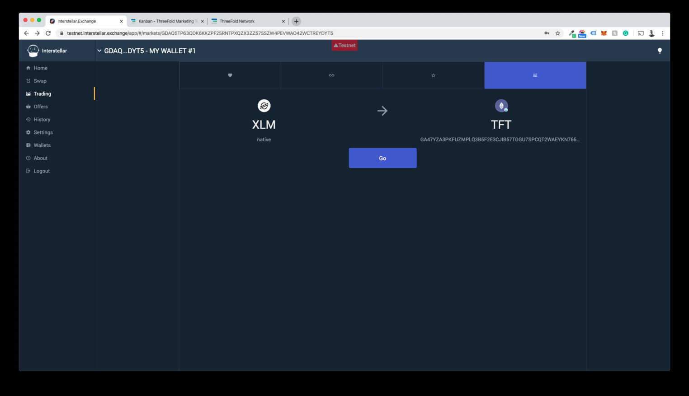

# Buy TFT on Interstellar  

Interstellar provides a complete digital currency experience to easily create, send, receive, swap and trade digital currencies and other tokenonized assets. Learn more about Interstellar [here](https://interstellar.exchange).

1. Click on `Login/Signup` on the top of the screen.
2. Go through the account creation process.
3. Create a random or custom wallet 
4. Store your secret key safely, preferrably offline. Losing your key will lead to losing your funds permanantly in the case of losing access to your account.
5. Send digital currencies that are compatible to the Stellar Blockchain to trade TFT.
6. Add TFT to your account by clicking `Add Token` in your account overview. Choose `All (Unverified)` and search for TFT. Another option is to choose `Manual` and add Asset Code: `TFT` and Asset Issuer: `GBOVQKJYHXRR3DX6NOX2RRYFRCUMSADGDESTDNBDS6CDVLGVESRTAC47`.
7. Create a trustline by clicking `Trust Asset` in the `About` section of the asset integration. Once the trustline is created, a success message will appear and the activity will be visible on the right side of the screen.
8. Now your account is setup and funded and you can start trading. To learn more on how to trade on interstellar, visit their [documentation](https://interstellar.exchange/docs/). 


!!!include:legal:tft_not_investment

## Details: Buying and Storing TFT on Interstellar wallet

Interstellar.exchange is a decentralized exchange that allows you to buy [TFTs](/tokens/threefold_token). 

See [Interstellar](https://interstellar.exchange).

The base currency of Stellar is XLM, the easiest is to start from this currency.

- [X] buy XLM on any exchange you prefer
- [X] load your XLM in wallet of interstellar
- [X] add TFT as trustline to your wallet in insterstellar
- [X] do the trade on interstellar site

This is a straight forward process and will allow you to buy unlimited amounts of [TFT](/tokens/threefold_token).

# Step by Step Manual

## Part 1: Create an account on interstellar.exchange

- Click Login/Signup.
- Choose Your Language
- Choose Your Preferred View: Light/Dark
- Click through the 6 USPs of interstellar.exchange
- Click Enter Account.

For Interstellar, all you need to do is set a password, as the wallet will be linked to your device instead of an email address.


- Set your password, Confirm it, and accept the Terms and Conditions
- Click Login: You now have your account

## Part 2: Create a wallet and adding funds to your account.

- Choose If you want to generate a random or custom wallet address (we are going for a random one in this case).
> **!DANGERZONE!** You are now presented with your Secret Key. Please follow all steps and read the procedures carefully.  Losing your key will most likely result in a loss of your funds. ThreeFold or Interstellar can’t help anyone restore accounts or the funds attached to them in any case!

- Your account is now created and you will have to send funds (digital currencies that run on the Stellar Blockchain only) to one of the wallets attached to your account.
- We have funded our wallet with $408 or 10.000 XLMs for this manual as you can see these are now shown in the account overview.

![]img/interstellar_account_overview_1.jpg)

## Part 3: Adding the TFT Asset to your account.

- Click Add Token in your account overview
- Choose All (Unverified) and search for [TFT](/tokens/threefold_token)
- You can also choose "Manual" and add the following data 

```
Asset Code: TFT
Asset Issuer: GBOVQKJYHXRR3DX6NOX2RRYFRCUMSADGDESTDNBDS6CDVLGVESRTAC47
```


The Asset is now added to your account, to trade the asset however you will have to create a trustline, you can do this by clicking on the "Trust Asset" Button.


When you have successfully created a trustline it will say success and the activity will show up in the right-hand column of the account page.


## Part 4: Trading Digital Currencies for TFT

Now that the account is set up and funded and you have the [TFT](/tokens/threefold_token) asset listed in your account with a trustline you can now start trading [TFT](/tokens/threefold_token).

- Click Trading in the left sidebar
- Then go to the most right tab to select the currency you would like to trade for [TFTs](/tokens/threefold_token) (XLM in the case of the screenshot) and press go



- You can now choose to fulfill a sell order from the order book, do a partial buy of an order,  or create you own buy order by stating the amount of [TFT](/tokens/threefold_token) you would like to buy and at what price. 


- You confirm the transaction and will get a success message when it has gone through, plus a little bell will also ring.
- You now have [TFTs](/tokens/threefold_token) in your wallet


!!!include:legal:tft_not_investment