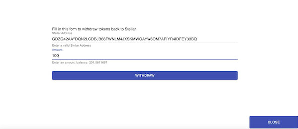
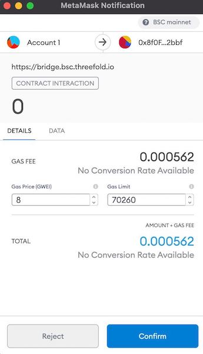

# TFT on Binance Smart Chain

The main home for TFT is Stellar network. You will need TFT on Stellar in order to reserve capacity on ThreeFold Grid. 
On the [Binance Smart Chain (BSC)] TFT is implemented as a cross-chain asset (BToken) (https://www.binance.org/en/smartChain).

TFT can be transferred between Stellar and BSC through a Stellar-BSC Bridge. 

## Contract info

The only contract address for TFT on the Binance Smart Chain is [0x8f0FB159380176D324542b3a7933F0C2Fd0c2bbf](https://bscscan.com/address/0x8f0fb159380176d324542b3a7933f0c2fd0c2bbf). Please check carefully whether this is the correct contract address.

## Set up BSC wallets

- Set up Metamask for BSC: Please find instructions [here](tft_bsc_metamask).
- Set up Trust Wallet for BSC: Please find instructions [here](tft_bsc_trustwallet).

## Bridge TFT between Stellar and BSC

### Withdraw TFT to Stellar Network

1. UI is already available. Visit the bridge page [here](https://bridge.bsc.threefold.io/) for withdrawal of TFT to the Stellar Network.

2. You will need to connect your BSC wallet, though clicking the top right corner.

<br/>


<br/>

3. Enter your Stellar address and the amount you want to bridge, then click withdraw.

<br/>



<br/>


4. Gas fees required for this transaction, to be paid in BNB, will be indicated in Metamask.

<br/>



<br/>

Your TFT should arrive shortly in your indicated Stellar wallet. 

### Transfer TFT from Stellar to BSC

- Go to the [Bridge Web UI](https://binance-chain-bridge-dapp.vercel.app/), sign in with Metamask and select the network you just created.


- Click on `Deposit from Stellar`. 
- A message will then appear with instructions that both address and memo text need to be exactly as indicated, or it will lead to loss of your tokens. Tick the box and then make the transfer using the indicated address and memo text. For your convenience, a QR code will be generated that can be scanned using the ThreeFold Connect app.


- Fill in the amount of tokens you wish to transfer from your wallet, and execute the transfer to the mainnet address ```GBFFWXWBZDILJJAMSINHPJEUJKB3H4UYXRWNB4COYQAF7UUQSWSBUXW5```.
- Shortly after, your TFTs will be available in your BSC wallet. 

> __Remark__ : usage of the Stellar-BSC bridge will reduce the amount of tokens arriving in the BSC wallet by 50 TFT. 


<!--- ### Transfer TFT from BSC to Stellar

TFT can also be transferred back to the Stellar network. You will need to sign from your BSC wallet, using Metamask. Gas fees required for this transaction, to be paid in BNB, will be indicated in Metamask.


--->

### Bridge TFT from Stellar to BSC via command line

Please find instructions [here](https://github.com/threefoldfoundation/tft/blob/main/bsc/bridges/stellar/transfers.md).


### Provide liquidity on BSC via Pancakeswap

Please find instructions [here](liquidity_provider).


!!!include:legal:tft_not_investment