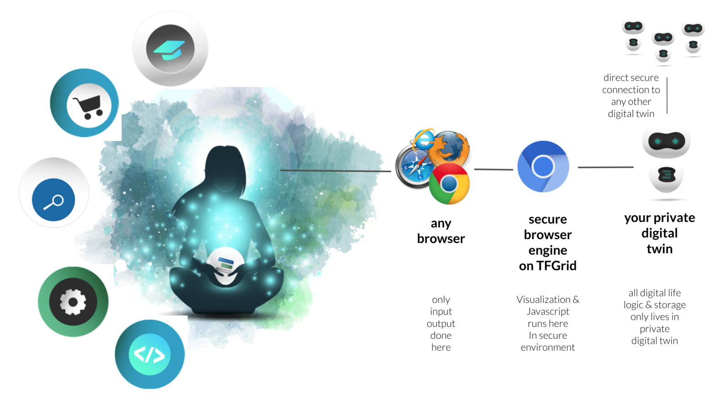
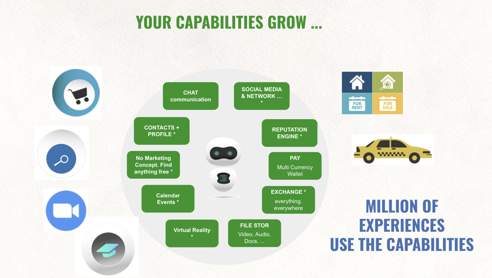
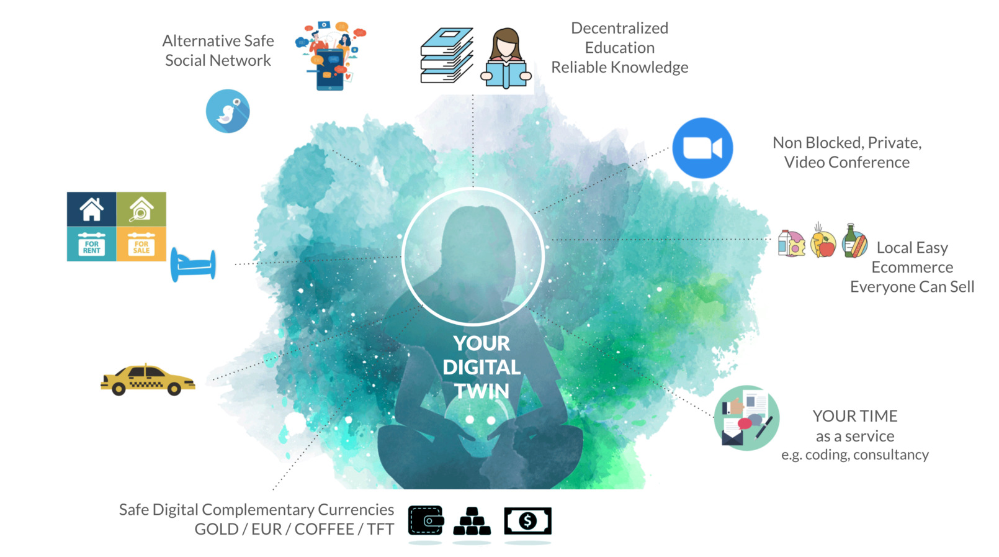
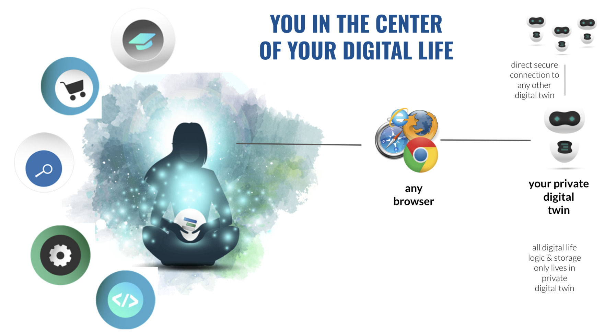
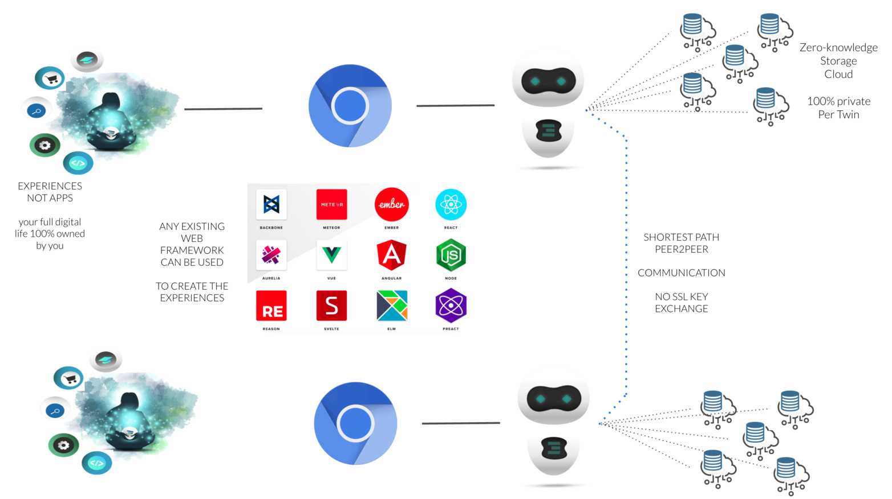
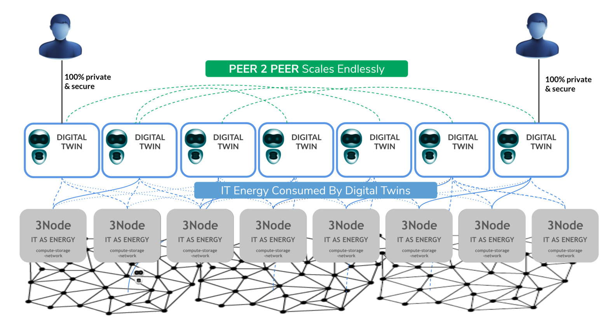

# Web 4.0 Digital Twin

Our web4 Digital Twin architecture puts the user central. The Digital Twin is a special mode of our TF Executor concept.

Each user has a private secure executor running which we cann a digital twin.

Every user uses any browser to access their digital_twin. Our TFCONNECT makes sure that the connection is secure.

The secure browser engine runs on the TFGrid close to where your Twin is.

This takes care of a very secure approach and unlimited scalability.

The twin has basic capabilities which are strongly version controlled but contributions from the global community are more than welcome.

The idea is to create a system which is simply good enough for any possible experience.

Rather than survival of the fittest we believe in a system of collaboration, where we invite everyone to make a system better so it fits us all. We don't need 3 chat systems, we need one which is usable by thousands of experiences.

Developers create Experiences on top, not apps. Experiences re-use the same capabilities.

This has huge benefits

- 10x less engineering effort needed per experience
- more sustainable (less energy loss)
- easier for user, no duplication
- more simplicy
- more powerful

> Coming H2 2022

### The Digital Twin Provides your digital life.

- full control over your own digital life.
- experiences to be created using standard web technologies (html, javascript).
- the digital twin delivers the web interface to your (secure) browser.

- no need for information to travel to central datacenters, all communication is fast and private between digital twins. No more client-server.
- all logic of your digital life is 100% private to you running in your twin.
- a secure browser engine makes sure that rendering and javascript execution happens in secure context, give hackers no chance (optional)
- this is super efficient and sustainable, +10x power savings.
- no blockchain required for your digital life = more privacy, performance, green
  - expception: blockchain is needed for digital currencies and as phonebook for digital twins identity.

### Any developer can easily develop experiences 

- super easy for any web developer to create experiences.
- the most efficient way how to provide for your future digital life.

### Ultimate Scale Out Capabilities

Peer2peer is the most decentralized way to experience our digital life.

- each user has 1 digital twin
- this twin serves your complete digital life
- the digital twin represents you and has all logic required to act on your behalf.
- all digital twins talk to each other over private secure links
- there is no blockchain involved for the compute, storage & network requirements.
- each digital twin needs compute, network and storage resources to survive, the twin will use TFT to reserve and pay for these resources as used on the ThreeFold Grid.
- The twin is the only entity who has control over the resource it requires, its all 100% private and no blockchain involved to reserve and use that capacity.