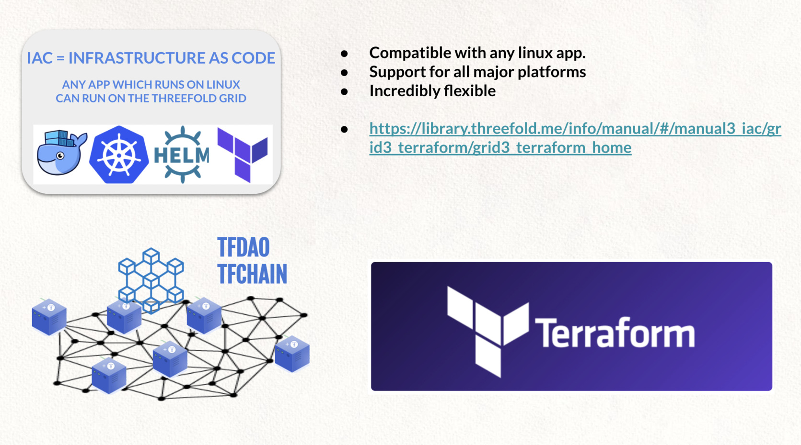
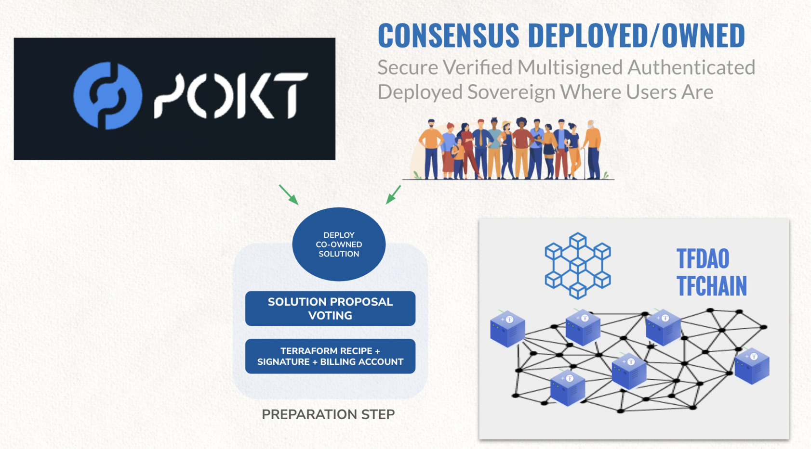

# Executor TERRAFORM 

A terraform script has multiple parts and can get deployed by an executor.

> [To learn more about primitives which can  be used in script see here](tfgrid_primitives)

>TODO

### Consensus Owned & Deployed Solutions

### Example with Pokt.Network

> Coming Q2 2022