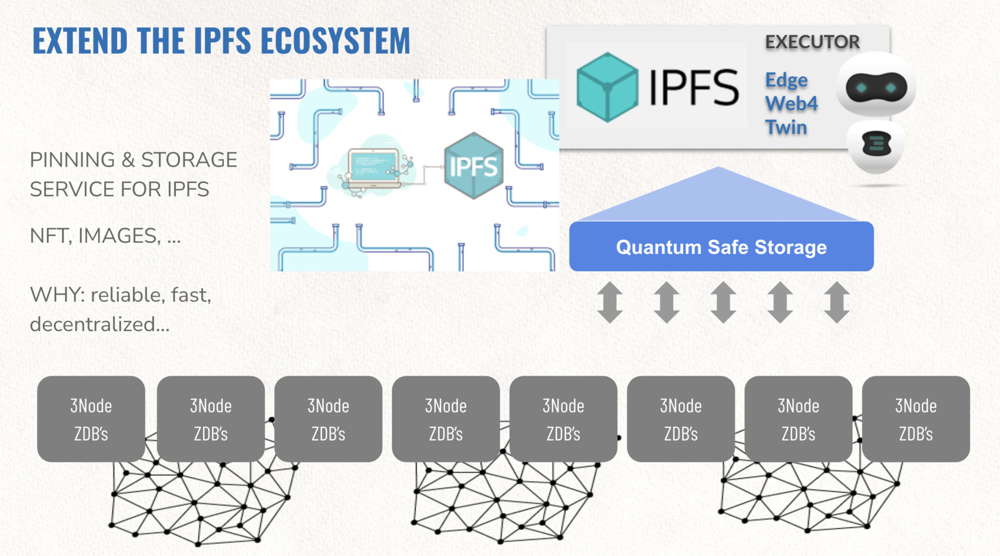

### IPFS storage integration on Web4

Each executor in form of web4 or twin is compatible with IPFS. 

Each IPFS object can be safely stored on QSSS. 

This provides following unique Features

- unbreakable storage for IPFS
- more distribution on global scale
- more performance for the enduser

> Coming Q2 2022