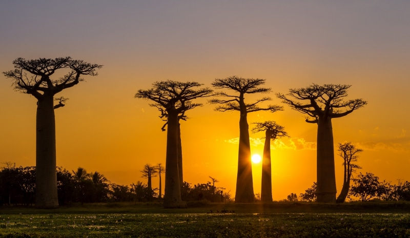

# INTERNET OF INTERNETS DEPLOYMENT PROCESS

We foresee a world with thousands of regional Internet Systems, they are all interconnected, but each of them is ultra reliable for millions of people. This approach allows unlimited scalability and equal chances for everyone in the world.

## Step 1: Your Regional Internet Chain gets initialized.

At least 50 people (we call them founding fathers) need to together decide to start their own internet, each of them installs a computer at home and boot our Zero-OS (our own operating system) on this node, each node will become a blockchain node for this new internet.

The 50 nodes can talk to each other and will be the base for everything else following, these 50 founding fathers of the new internet allow the birth of a new co-owned powerful internet.

All software and initial data required gets downloaded on the first 50 nodes, this makes this regional Internet system 100% independent of any other Internet System (old or new). Everything is now available locally (knowledge, data, software, …) to be able to grow the regional Internet system.

Once this step is done the Founding Fathers will make a proposal towards the Mother DAI to suggest the founding principles of the new Regional Internet. The principles is a set of principles and parameters about how the regional internet will be established and includes initial farming rewards, details of tokenomics, minimal required funding per blockchain node, APR on investment in the DAI, minimal required funding for the DEFI pool, …

## Step 2: Regional Internet DAI gets funded.

DAI = Decentralized Autonomous Internet, is the base governance layer for a regional internet. Each blockchain node of the DAI needs between 20 and 50k USD worth of TFT as has been approved by the mother DAI. Example if we have 50 nodes at 50k USD per node then there is minimal 50*50 = 2.5m USD initial value locked in. This is the starting securitization of the DAI.

Typically at the start the Regional Internet DAI Founders get 20% APR on their initial staking. A blockchain validator needs to maintain a minimum liquidity in the liquidity pool.

Please note that this initial funding is only to the benefit of the OurWorld local and global ecosystem. Every $ which comes in the system is available as liquidity, internet capacity or co-creation budget.

## Step 3: Internet Farming

Digital Farmers (local community) start deploying ThreeFold Nodes (the computers which will host all our data and applications for our OurWorld System). Each Digital Farmer farms CHI (the local version of the ThreeFold Token, TFT) for farming network, storage and compute capacity. The first 100 nodes get a special farming rate, to get the system started quickly. 

CHI is only usable in the local regional internet for buying/selling the local internet capacity. CHI can be exchanged to TFT over the DEFI system, as such TFT becomes like the reserve currency of the complete ecosystem.

## Step 4: Our World Experiences

Now that we have a working internet and money system, it's time to deploy internet experiences. 

The system will be initialized with following initial experiences:

* An incredible powerful metaverse and augmented reality system
* Office & Collaboration Tools like gdocs alternative, zoom alternative, forum, learning system, …
* An educational system with thousands of video’s and millions of pages with education content is made available. This educational system has already been viewed more than 4 billion times.
* An ecommerce and index/search engine to allow everyone to exchange anything for everything.
* A Decentralized Cloud system, allows everyone to deploy anything they need locally.
* A system for farming and carbon credit harvesting.
* A financial system to trade in all safety and link back to the existing internet and banking system.
* … and so much more …

This system out of the box, has enough capabilities to empower our digital life

## Step 5: Communities help their peers and expand the system.

OurWorld volunteers help people in their communities to get started with any possibility of the system.

A reputation and strong identity management system makes sure that the system stays secure and allows everyone to be safe and trust each other.

Every OurWorld member can now expand the system with art, music, metaverse expansion, … for all of this effort CHI tokens are rewarded. When needed validation of effort will happen by the community as well, reputation is the driving force of OurWorld we are building.

As demand grows, more digital farmers will add nodes and make connections between the nodes (can be existing internet), this has the capability to let the system grow to any required size.

We now have a fully working OurWorld Internet of Internets system running with a liquidity pool, education system, internet experiences, … 
