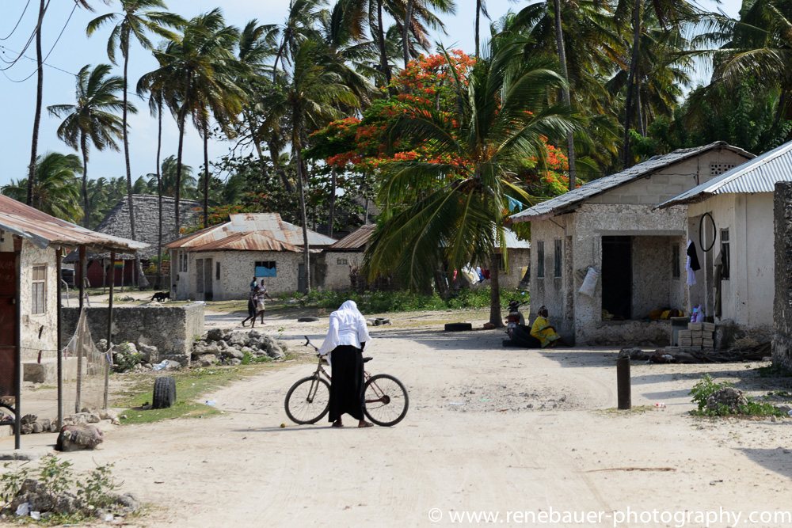

# EXAMPLE COMMUNITY CLOUD FOR A SMALL VILLAGE IN ZANZIBAR

This is an example of a small village of 30 families which might spend 10k USD (can be wholly or in part funded by grants from a DAI) to build out their own peer2peer internet infrastructure. We call this process digital farming.

The local community deploys storage and compute capacity and also makes fiber network connections to the 3 neighbor villages which are close by. Each village is now connected over multiple gbit links (100x faster compared to today) and 100% redundant, this network can not go down.

This 10k can come from the village itself or (partially) granted by a DAI. The DAI has a large treasury and can co-invest in infrastructure. The infrastructure (network, compute and storage) produces income per month. A 10k investment can easily return 200k USD for early digital farmers.

There is very limited knowledge required to start a digital farm. At start we have videos to help out on each required step in the local language, later on there will even be augmented reality courses. The TF DAI motivates villages to help their peers and as such provide knowledge and training to each other, it's in the absolute best interest of a village to help their neighbors. A growing digital ecosystem helps them all.

As an example in Zanzibar most families can’t afford a decent internet connection, mobile is still very spotty and landlines are not affordable. Thanks to our approach a community will make money rather than having to spend, digital farming generates income.

In Zanzibar The Internet System will help the participants to get started with projects like:

* Organic regenerative farming (products bought & sold by means of the internet they have farmed)
* Farming of Carbon Credits (a huge possibility for redistribution of wealth)
* Growing of bamboo and hemp for building materials and carbon credit harvesting (serious opportunity)
* Growing of rare herbs, assisted by augmented and video learning programs
* Producing organic fertilizers
* Access to a health information and digital doctors.
* Farm to table programs
* Host conscious communities or help create eco-villages
* Ecological building projects (again using our education systems)
* Education, Coding, Translations, Web Design, … everything will become possible…

**Benefits for the small village**

* **Free internet (well actually they make money from it, if they are early)**
* **Education & e-learning (text, video, virtual and augmented reality)**
* **Fun activities with peers all over the world, cultural expansion (gamified)**
* **New economic activities (income in regenerative sustainable way)**
* **Empower young people, don’t lose them to the existing too capitalistic & brainwashing internet**
* **No need to ruin their farming land, e.g. get access to organic non harmful fertilizers over our internet**
* **No need to sell off their properties (now often needed to survive)**
* **Allow others to learn from their knowledge and experience, often they know a lot and are happier compared to the so called “civilized” communities.**
* **Get access to the external world (digital banking, video conferencing, virtual reality museums…)**
* **A sense of purpose, because they can build out their own future!**

**Benefits for the country they live in**

* **Money does not leave the nation, this internet is GDP positive!**
* **The country has sustainable income streams for their citizens, maybe less tax needed**
* **Less money needed from outside the country (less loans)**
* **Keep bad influences outside (e.g. chemical fertilizers is bad it enslaves the country)**
* **New huge opportunities e.g. industrial hemp (nothing to do with cannabis), carbon credits, organic fertilizers, organic regenerative seeds, token models for digital assets, digital banking…**

## Not only for emerging countries

This Internet of Internets concept is not only for emerging regions. Each nation has to become sovereign and independent. It's an important step for humanity to grow to the next step of awareness which is urgently needed.

# 

