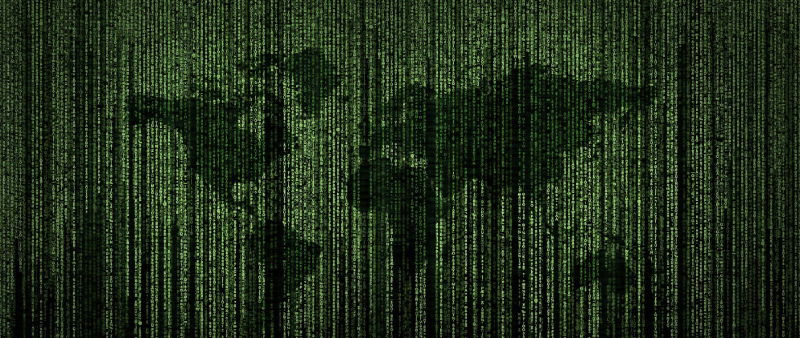
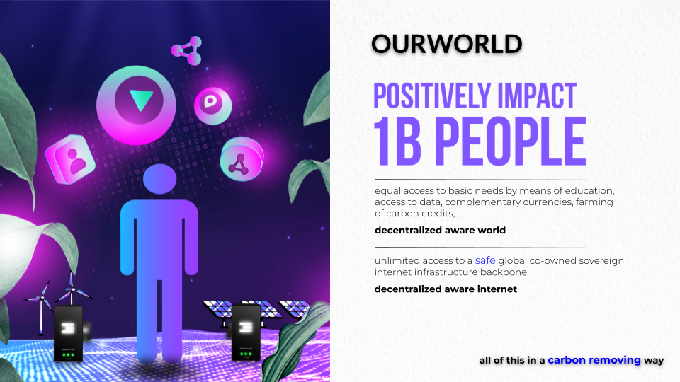

# WE ARE ALREADY IN THE MATRIX, LET'S GET OUT.

Today most of us are living as slaves in a big system without realizing. This system is based on money, money is the biggest drug in the world right now. Money by itself is not bad, it's the way we use it today as the fuel of our current limited system. We like to think about money as ‘frozen time energy’. 

Today, this ‘frozen time energy’ mainly flows from the ones who don’t have enough to those who already have plenty. \
There are 3 main mechanisms which make this possible:

1. Interest
    1. Example, in Germany 40% of any product you buy covers interest related cost (compound)
    2. It's also a mechanism to enslave people and countries. Compound interest is a real problem.
2. Marketing / Promotion 
    3. For a retail product, up to 50% goes to promotion.
    4. Is promotion in our interest? What's wrong with the little post-it note on the whiteboard of our supermarket, that was an (cost) effective way to find something.
    5. Current system is about creating new desires by exploiting Data with the most advanced psychological and neuroscience discovery to hack our brain and play with our tensions, vices and pulsations... rather than answering our essential needs in a healthy way.
3. Lock In and Intermediaries
    6. We are locked in by websites or products of large companies, this leads to power centralization.
    7. Many find themselves in a trap where they barely benefit from the products they produce, an example is gold, bananas, coffee, … less than 5% goes to the producers.

**All of this together means that we keep less than 10% of our economic output for our own benefit, we could argue that this makes us officially a slave of an unfair system. More info in **[http://thematrix.ourworld.tf](http://thematrix.ourworld.tf) .

What if we together create a new type of Internet not based on scarcity and fear, but based on trust and abundance? A system which gives everyone equal chances and allows us to together create a new world called “OURWORLD”. \

**OUR SOLUTION:  \
an abundance based OURWORLD. \
 \
**

OurWorld (using ThreeFold Technology) allows us to co-create our own digital future together.

Imagine a world 

* Without a need for manipulative marketing, everything can be found for free and is equally available…
* Without exchange fees, everything can be exchanged for anything without cost.
* Without interest, we together create a stable internet currency to fund our own future.
* Without lock-in or manipulation, no deep fakes, a tangible reputation system protects us.

Imagine a digital currency

* Backed by the fastest growing commodity in the world = Internet Capacity
* Co-owned. We all together generate this currency by generating this Internet Capacity.
* Carbon negative, remove carbon from the air, as compared to wasting energy to mine a token.
* Globally available as a real utility token.

Imagine an economical system

* Which allows us to generate 5 to 10x more beneficial wealth compared to today (more effective).
* Which allows us to generate wealth for the people who have been underserved.
* Who allows everyone to partake, NO EXCEPTIONS.
* Which is not based on the “money as drug” concept where money flies from people who don’t have enough to people who have too much. Money is not the path to happiness.
* Where money is not something dirty but represents “frozen time” energy, a mechanism of exchange.
* Which is based on safe digital currencies like carbon removal credits, threefold tokens, …. \

**JOIN US IN THIS GAME OF LIFE.     LET'S PLAY.**

# 

