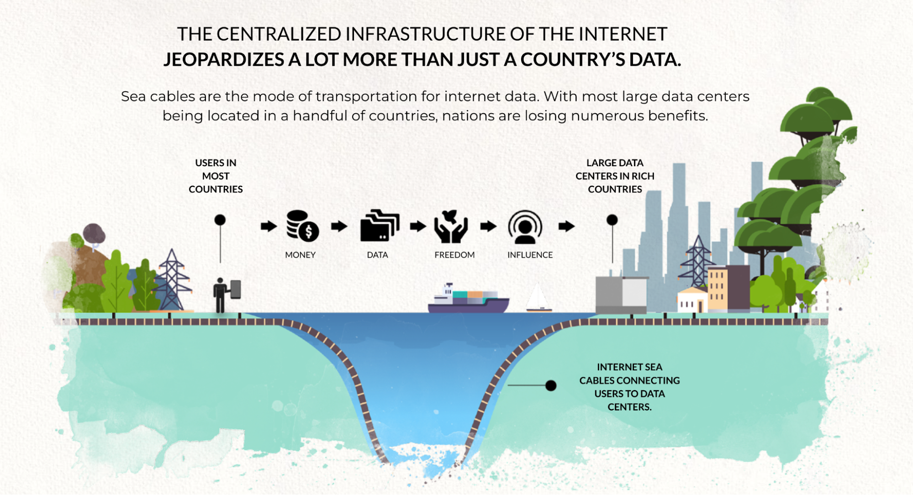

# OURWORLD INTERNET OF INTERNETS, SHORT DESCRIPTION

To create an upgraded abundance based system we need to provide following 3 pillars:

* a regenerative, safe, sovereign internet infrastructure layer = ThreeFold
* an integrated stable decentralized financial system (DEFI) 
* a set of experiences (applications) and information to allow everyone on equal basis to learn, create, exchange, travel, … basically experience the abundance based world

Imagine a world where communities can build their own internet, from scratch, an internet which would deliver all the needs for a different future life. Each Internet deployed by the people for the people is called an OurWorld Internet.

In each OurWorld Internet abundance is the base:

* lots of free information, education, knowledge (books, encyclopedias), earth information (maps, videos), art (music, video, …), …
* Your applications required for your digital professional and personal life are all free
* You can find anything for free, you can promote everything for free.
* You can freely exchange anything to anything else (money for good, good for good, money for money, …)
* There is no need for interest, lending money can be organized differently.

This internet is “a peer2peer people’s internet”, created and owned by all of us together. The economic principles are dramatically different. Everything is available to build your own internet, from scratch. As a starting point you only need some computers and standard network equipment, all the rest is achieved by the magic of our threefold opensource software.

## The Internet of Internets integrated DEFI.

Each Regional Internet hosts and connects to its own set of blockchains and web 4 and banking 4 functions, which interact with global public blockchains like Solana, Ethereum, Casper Labs, Cosmos, Stellar, Algorand any blockchain actually… 

Each Regional Internet is responsible for

* Identity & reputation management of community linked to the Regional Internet.
* DEFI blockchain with links to any other possible blockchain as required.
* DAO = Decentralized Autonomous Organization 

Each Regional Internet hosts a capable decentralized financial system (DEFI) which operates on multiple levels:

This Ourworld DEFI system is unique because it allows integration of any other local or global blockchain token in such a way that the token is usable from within the OurWorld Instance even if for whatever reason connection with the global network would be broken, as an additional benefit using the external token without OurWorld would go faster and not need the energy as sometimes needed for other tokens like Bitcoin (today 100USD worth of energy per transaction).

The DEFI system is also the liquidity pool and treasury (initial funding) for each OurWorld Internet.

## The Internet of Internets is Reliable

Each Regional Internet is ultra reliable.

* Data can never be lost nor corrupted.
* Internet lines can be cut, even if all public Internet connections would go down, the local instance would still function, allow financial transactions to happen, allow information to be consulted, data is local and safe.
* The distributed nature of the Internet of Internets is even war safe, a disaster or war situation has no impact on the reliability of the internet (if enough distribution achieved)
* All systems are local and sovereign.

Because it's an effort by the people for the people it has by design more support from everyone, it can grow unlimited.  

## The Internet of Internets is OpenSource

All components inside the system are open source, all of the code and knowledge required is delivered as part of the local deployment. Purpose is that every community can contribute and co-create our own future.

It's a platform created by all of us for everyone. There is a 100% decentralized code management system integrated to allow this to happen.

## The Internet of Internets is Complete

There are tens of incredible experiences ready to go. \
The Following Experiences are deployed in each OurWorld Instance

* Sikana (education system with lots of content, +4billion views today)
* Uhuru (alternative on Office 365 of Google Docs/Drive)
* Alternative to twitter, whatsapp, facebook, … 
* and so much more …

Following quickstart materials will be available (as part of last fundraise project)

* A full ebook (hundreds of pages) with all details information as needed to deploy a Universe
* Augmented/Video education how to deploy a OurWorld System.

Following information and content will be available 

* We are execution on a huge effort to download and categorize +40 Petabytes of Information from the existing internet, this information will be available in each OurWorld Instance, making sure that all this information is protected and available to everyone in the world independent of what is or will happen
* It's an endless stream of information (maps, educational content, source code, knowledge, ebooks, …).

## Countries do need their own Internet !

# 

We want to help countries, many countries find themselves in a challenging situation where they run out of money, have too much debt, people are potentially unhappy, there could be a risk of conflict, … We believe a decentralized Internet of Internets could help. Some very concrete benefits for a country to get started now.

* Today's internet is extracting money from countries rather than adding
* By implementing the peer2peer internet this gets turned around.

On the security side, the Internet is super centralized today and actually very vulnerable. The Cyber Pandemic is a reality, see [opinionated security brief for a government (long document).](https://docsend.com/view/amg5jnmcwaejehju) We need to act now, our internet is at risk !!!

