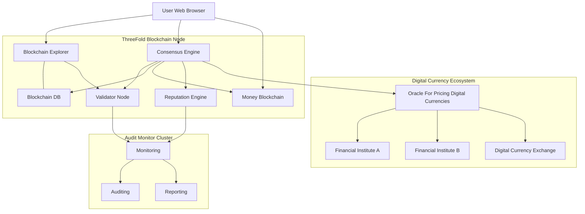

# Digital Nomad and OurWorld Backbone

ThreeFold has developed a capable system which can be used to streamline the way in which we deal with the core services like identity, license approval, company creation, tax registration.

A strong blockchain based backbone is available to host all required services.

This system is used to deploy all available services on.

## High Level Architecture for the Backbone

The system above is very scalable and can deliver any of the required business and government flows.

## Requirements

- Data can never be lost.
- Every transaction is logged in a blockchain and available to the auditing modules.
- Consensus needs to be achieved between all parties for relevant transactions
- Strong identity is a must, see that section for more info.
