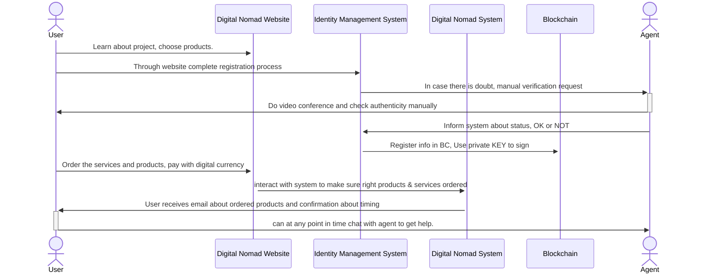
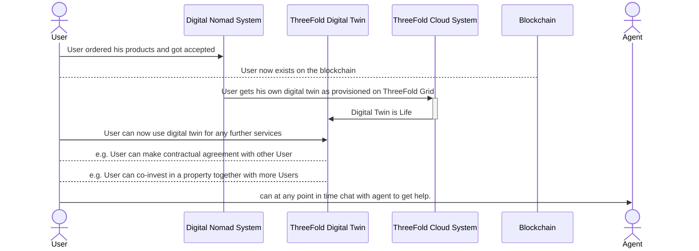

# Digital Nomad Onboarding

A digital nomad who wants to become a customer of the OurWorld System will have to do the following

- The user sees the different offerings on a website hosted from Zanzibar 
- The user needs to become a member of our system before he/she can register for the chosen offering
- The user needs to go through the [identity management system](identity.md)
- Once completed, the user can select required products and will get detailed proposal online.
- There is a chat button on the website which the user can use to get help at any point in time.
- The user needs to load his/her wallet with money (to be defined e.g. a Digital USD)
- The user now gets confirmation that company is created and chosen products available

## Process Frontend

## Usage of Digital Twin

Each user will receive a digital twin which is living on top of the Local Internet as deployed in Zanzibar.

Check here for more info about [Digital Twin](../web4/architecture_highlevel/web4_digital_twin.md).

A digital twin is used to further work with all services as provided in the Digital Nomad Sandbox.

