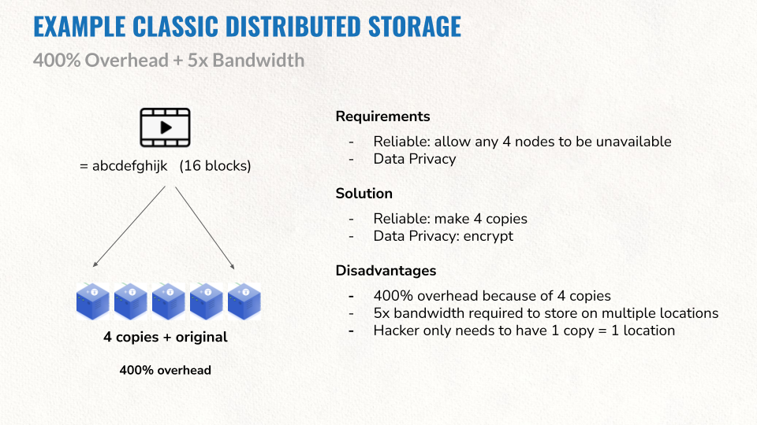
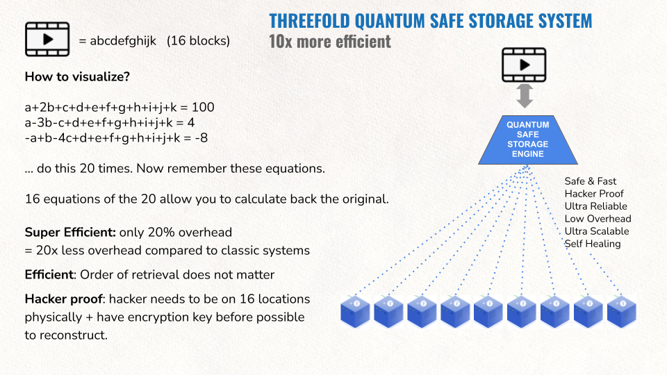

# Appendix A: Quantum Safe Storage Internals

In a classic system data gets replicated (sometimes shared, means over many locations). To allow 4 nodes to fail, 5 copies would be needed. This leads to some concrete disadvantages as described above.

In our system each object is fragmented into 16 parts. So we have 16 original fragments for which we need 16 equations to mathematically describe them. Now let’s make 20 equations and store them dispersedly on 20 devices. To recreate the original object we only need 16 equations, the first 16 that we find and collect which allows us to recover the fragment and in the end the original object. We could lose any 4 of those original 20 equations.

The likelihood of losing 4 independent, dispersed storage devices at the same time is very low. Since we have continuous monitoring of all of the stored equations, we could create additional equations immediately when one of them is missing, making it an auto-regeneration of lost data and a self-repairing storage system. The overhead in this example is 4 out of 20, which is a mere 20% instead of (up to) 400%.

More info see [https://library.threefold.me/info/threefold#/technology/qsss/qss_algorithm](https://library.threefold.me/info/threefold#/technology/qsss/threefold__qss_algorithm) 