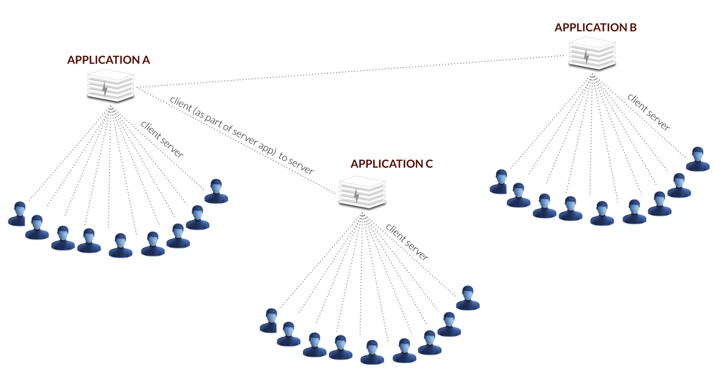

# 99% of all current financial banking solutions are client server

* The servers run as applications inside high security datacenters (complicated and costly),
* Most of the processes in those servers are repetitive = highly inefficient,
* There are many interconnected functions which make the systems error-prone and very expensive to change.