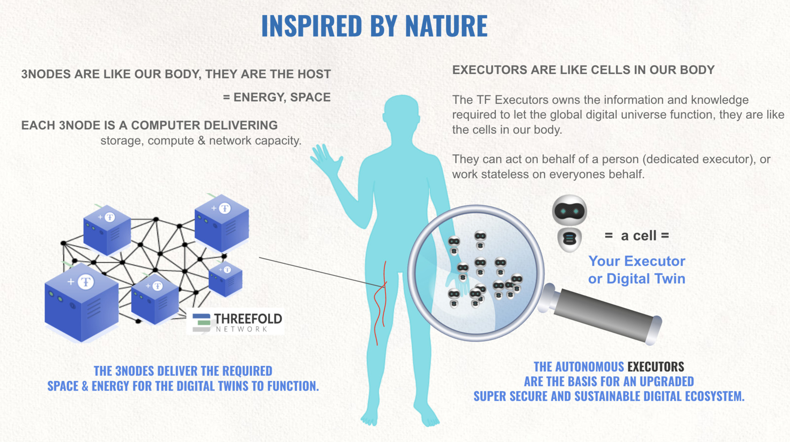
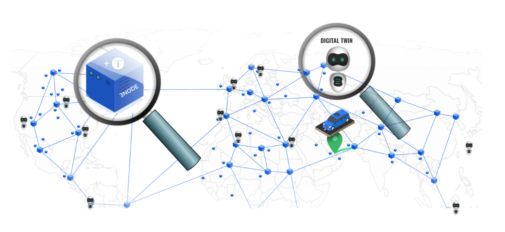

# Inspired By Nature

* Just like we have trillions of cells in our body, so can billions of digital twins live next to each other.
* Each twin represents a person with all its digital needs,
* Each twin has memory, knows how to communicate, has knowledge, history, …
* Twins, like cells, cannot live without a body = a secure ThreeFold Grid Cloud (???? )
* can be private per fintech institute.

This approach scales for ever

* There can be unlimited amounts of ‘3Nodes’ (= compute/storage boxes producing Internet Capacity), as well as Executors (Digital Twins and Web 4.0),
* There are no bottlenecks nor centralization points,
* Our Peer To Peer network technology takes care of routing and security issues between the Twins and the 3Nodes. The shortest path is always the best.