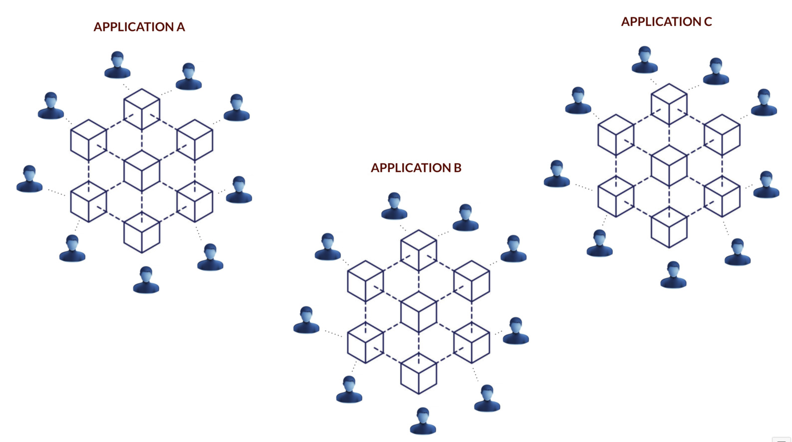
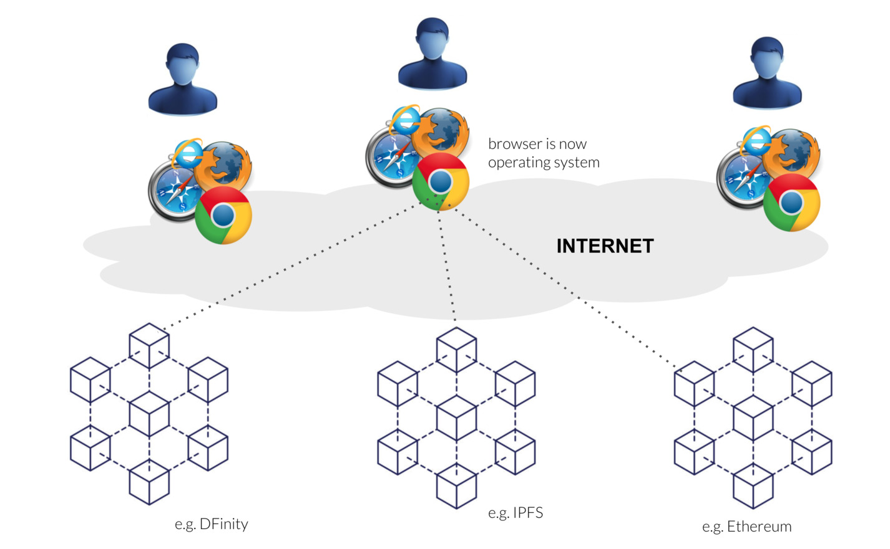

# Blockchain Based Web 3.0 Vision

Blockchain decentralizes the server, but in principle it remains a ‘client - server’ model.

* It is definitely a step in the right direction but the paradigm is the same,
* We, as users, still exist in different systems and have to deal with different applications (protocols).
* These blockchains can be integrated, and through Web 2.0 concepts, the web application can interact with multiple blockchains at the same time.
* This is called Web 3.0

The browser has now become our operating system, it is running on javascript. All applications run in our browser and interact with multiple blockchains.

Web 3.0 can be used for fintech applications but there are some issues to consider

* Scalability issues are very hard to resolve if everything is done on blockchain,
* All transactions are visible, this leads to information leakage which is often not wanted,
* DEFI is a great possibility but if done on blockchain, leads to limitations of what can be done, and possible security issues in the future.
