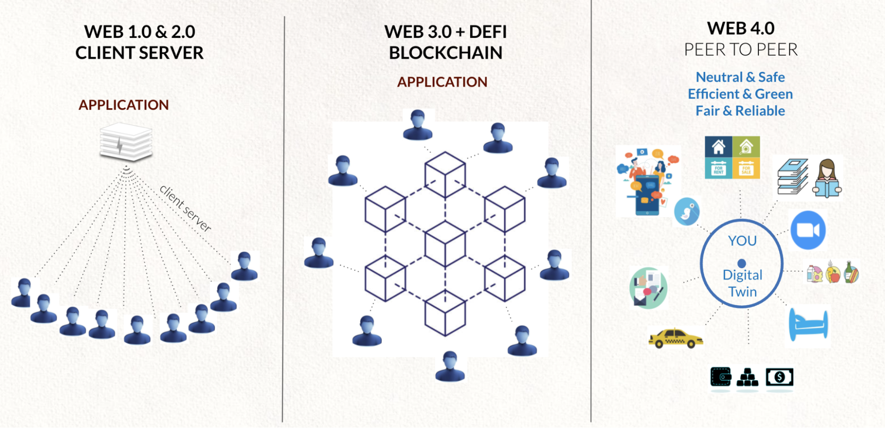
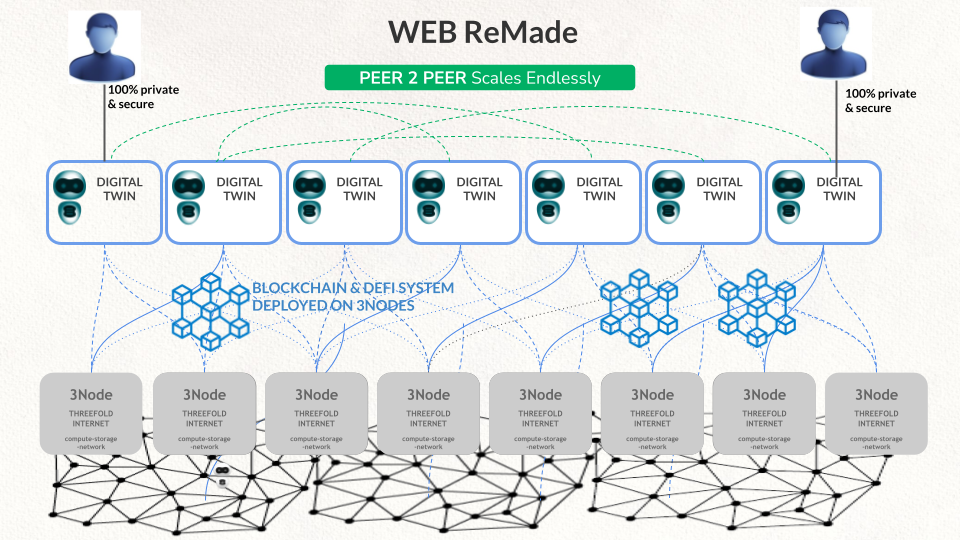

# Web/Banking 4.0 = digital twin technology

Web 4.0 is user-centric,  

* every user is in control of its Fintech and Internet experience,
* blockchain needed for specific functions (money, identity, smart contracts, …),
* Up to 10x more efficient,
* data sovereignity for all (GDPR and other regulations can easily be achieved).

Web 4.0 alone is not usable for many Fintech applications but, once combined with Blockchain technology, it has the potential to be the most exciting backbone for any future Fintech Applications.

**Hence, our solution to combine Web 4.0 and Blockchain, see below.**

Peer To Peer is the most decentralized way and offers the best possible security, it's much easier for hackers to go after a centralized system.

* All executors talk to each other over private secure links,
* There is no blockchain involved for the compute, storage & network requirements,  \
which keeps data more secure
* Each executor needs compute, network and storage resources that are managed by ‘Validators’,
* The executor (Web 4.0 or twin) is the only entity who has control over the resources it requires,
* It is all 100% private and fully Peer To Peer.

**Imagine a ‘Digital Banking Application’ which is able to mix the benefits of blockchain and Web 4.0, this would lead to huge cost and reliability benefits, while providing the most user friendly experience ever.**