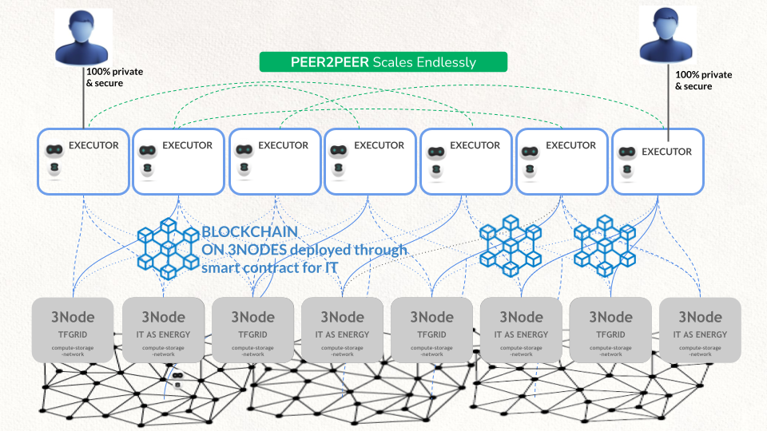

# Unbreakable Deployment

Ultra Scalable & Secure Decentralized Deployment

Example deployment

* 100 offices or branches with ATMs (bank) get 1 to 3nodes each providing compute & storage to a private grid.
* Each node runs Zero-OS which has no shell and cannot be accessed by any person in the bank.
* None of the nodes has enough data to allow anyone to reconstruct the data.
* The different nodes together deliver a super resilient network of compute & network resources.

**Even if, in a disaster scenario, 30% of the locations would go down, the system would still function and be available to its users. This is the most reliable deployment possible in IT landscape today.**

What runs on the 3Nodes

* Blockchain Nodes
* The distributed storage system (ultra safe, zero-knowledge proof)
* Digital Twins for users (optional)
* Secure Browser Engines
* Stateless banking apps.

This can then be combined with super nodes running in even more secure places for more central apps if there are any.

This system works with and enables the planetary network and quantum safe storage system.
