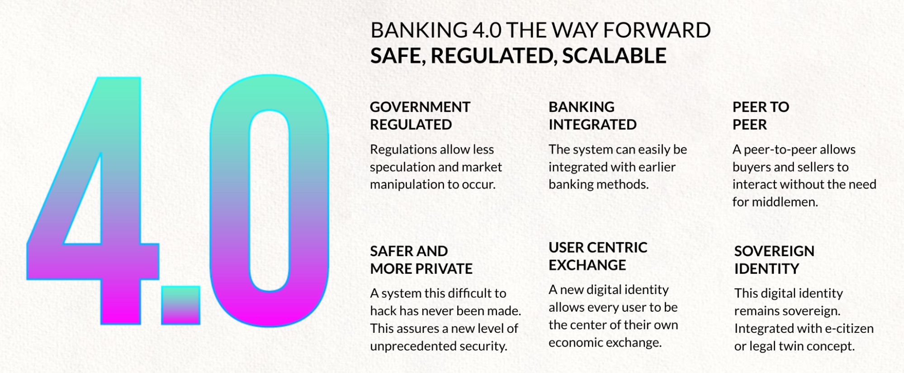
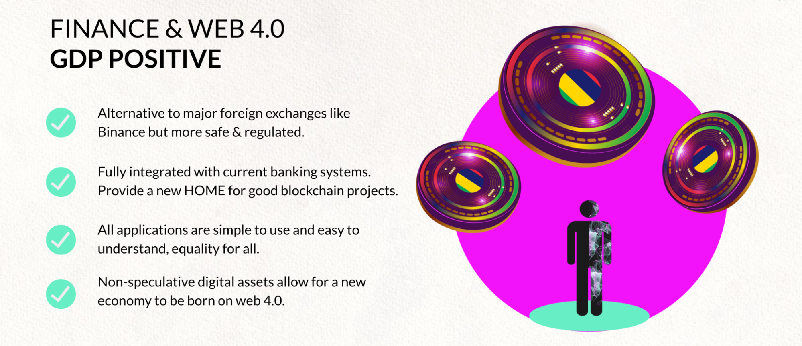

# Introduction

Web 4.0 and Banking 4.0 Platform

Blockchains are leading the way to the next disruption in the FINTECH industry.

DeFi (Decentralize Finance) and Digital Ledger technology (Blockchain) allow much more cost-effective deployments, at larger scale, without having to rely on ultra expensive and complicated old fashioned financial backend systems.

|Classic Banking System|New Modern Digital Systems|Banking 4.0 Platform|
|---|---|---|
|± Any bank right now|Example Revolut, millions of users in no time, at incomparable low cost|Each banking user is in the center of their own financial life.|
|Ultra costly to scale|Cost Effective|Much More Cost Effective.|
|Became incredibly complicated and cumbersome to maintain and create new revenue opportunities for the vendors|More simple systems, but still centralized, scales quite well.|Ultra scalable and many exciting new functionalities prospect.|
|Non Transparent Fee Structure|Transparent Fee Structure|Transparent Fee Structure, DAO Based Governance, Made for volume.
|Unsafe, bank’s hacks are all over, complexity leads to security risks.|Hacking is still a real danger because of centralization.Very safe, probably the safest at this stage. Low cost to operate. Strong integration with regulation.|Cannot compete with newer digital systems, ± impossible to make really safe.|
|Is regulated, enormous growth. These systems have the capability to replace a larger part of classic banks for a large part of functions, which means classic banks become more specialized and have the risk of ending up with a non profitable business case.|Central banks are starting to work on CBDC (central bank digital currency) using blockchain tech.|In older blockchain systems (not ours) people might abuse the information as stored on blockchain (trading pre-knowledge, bots, …). These systems might also be too limited in functionality today, can be used as a base for a new revolutionary banking system.

**Our aim is to provide a solution using blockchain technology, more scalable, way much safer and not as vulnerable to abuse by its users, we are combining the next Web level called Web 4.0 and Blockchain.**

We do believe the next generation Fintech 4.0 solution can be built with the following benefits

* Decentralized, yet ultra secure, and auditable for required use cases.
* The decentralized nature leads to the highest security & reliability.
* Most cost effective.
* More complicated use cases can be implemented compared to ‘blockchain’ only solutions.
* Allow ongoing innovation and creation of the most powerful, yet safer, fintech solution.
* By design, it is 100% GDPR compliant.
* Completely aligns with Sustainable Development Goals

Our aim is to protect, and to provide massive added value to :

* **Banks, IFI’s,** and other fintech organizations (e.g. Exchanges)
    * Deploy and operate a future proof digital bank and gain required speed to market / scale globally
    * Competitive Advantage (sometimes needed for survival in todays circumstances)
    * Exciting new services offering exciting new business models or revenue opportunities
    * Ultra scalable at unmatched cost basis
* The **Users**
    * GDPR, data privacy, protect from hackers, protect from abuse from fellow users like on blockchain
    * Easy to use system with lots of possibilities
* The **Planet**
    * Carbon Negative, Ultra Scalable while using lot less hardware and energy resources.
