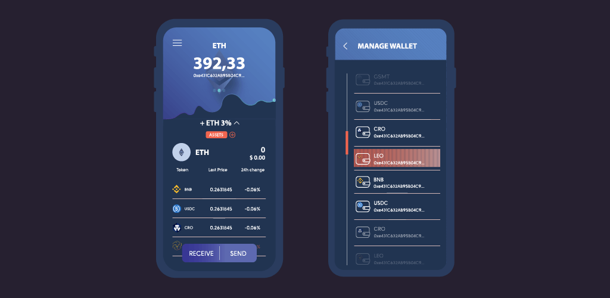

# Easy To Use Wallet / Banking Apps

## Easy To Use Wallet / Banking Apps

Together, we will design the customers’ wallet, and leverage our existing platform to create the user experience the Bank wants to provide to its customers.

The wallet is using the above described ‘Browser Firewall’ technology, with three to four ‘Authentication’ levels.

The wallet also serves as the ‘Authentication divide’ to any portal, or to any applications the bank wants to deploy.

The ‘root key’ is stored on the phone, or in the Security Knox Vault (optional). For each use case, a derivative key is being generated which can be revoked by the user or the Fintech party, in case this would be required.

The ‘root key’ can also be stored on a USB device for users who require even more security.

The wallet can provide all the required functionalities

* Account management,
* Transfer money to accounts inside & outside,
* Exchange money to other assets (gold, digital currencies),
* Safe Trading (based on our Peer To Peer Exchange),
* Profile Management,
* Reporting spending and other transactions,
* Management of debit and credit cards,
* Status of verification (KYC/AML).

The functionalities are implemented using Peer to Peer twin technology, as well as, blockchain based backend technology for money, identification, KYC/AML, …