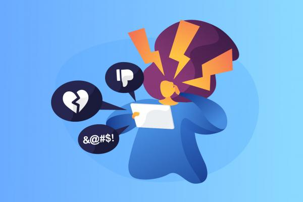
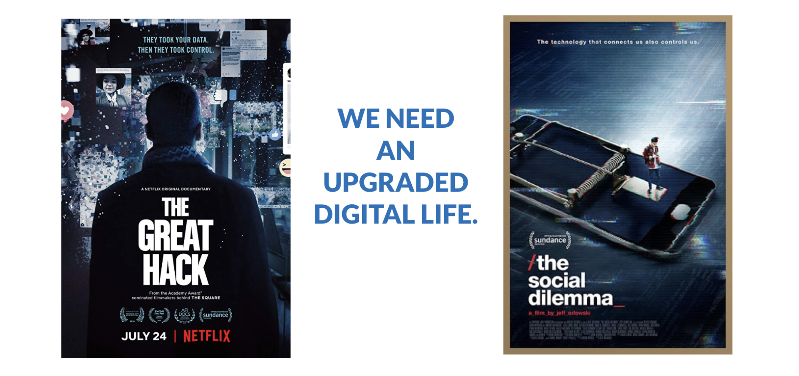

# **Internet Mental Health & Abuse Is An Issue**

Next and aside from privacy and security issues. 

## **Information Manipulation**

Manipulation of data leads to huge side effects even going as far as manipulating election results and even genocide in some cases.

It's becoming extremely difficult to distinguish between truth and untruths, one of the issues which need to be addressed is the role of anonymity and reputation. A new internet paradigm is needed. 

 \
See:

[https://www.diplomatie.gouv.fr/img/pdf/ \
information_manipulation_rvb_cle838736.pdf](https://www.diplomatie.gouv.fr/img/pdf/information_manipulation_rvb_cle838736.pdf)

See e.g. [https://africa.businessinsider.com/tech/ \
Google-reportedly-manipulates-search-results- \
to-hide-controversial-subjects-and-favor/cs54s31](https://africa.businessinsider.com/tech/google-reportedly-manipulates-search-results-to-hide-controversial-subjects-and-favor/cs54s31)

## **Internet is unhealthy for the mainly young population = mental health issues**

See e.g. [https://www.theguardian.com/technology/2021/sep/29/facebook-hearing-latest-children-impact](https://www.theguardian.com/technology/2021/sep/29/facebook-hearing-latest-children-impact)

Some unhealthy side effects:

* Addiction (too much screen time, ignore normal social interactions)
* Unhealthy relation to the ego.
* Manipulation of information leads to extreme behavior.
* Self-esteem issues.
* Mental health issues.

See other documents about why an improved internet is needed, a peer2peer internet will amongst other things help fix above-mentioned issues.

