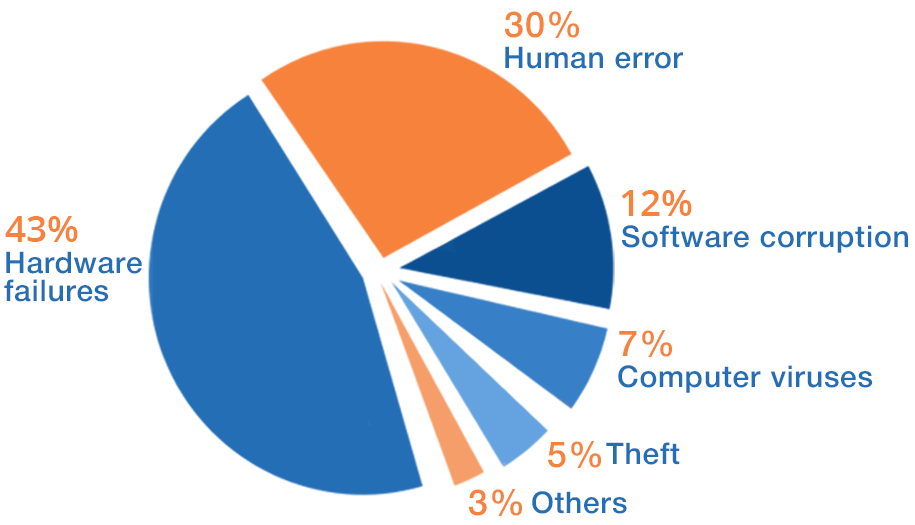

## **Data should not be on centralized clouds or user machines (desktop/notebook)**

  

### Centralized Clouds

Many governments today rely on centralized services like Gmail, Google docs, Microsoft office. This leads to a lot of exposure to sensitive information. The information leaks all over the world and ends up in many locations. It's impossible to secure information this way.

Because often existing IT systems are not flexible enough, government instances will turn to these services and sometimes even use their own credit card to get the flexibility they require. This can happen on a small or large scale, even if there are often strict guidelines given that this should not happen.

> We believe that relying on centralized systems from cloud vendors out of your country is not a good approach (backdoors, information theft, too easy to share, no ability to control, ...)

Often the more regulations introduced the more people will go to systems outside of their government sometimes even the country. In other words security framework or regulations often do not help.

### User Desktops

  

Despite apparent reliability of modern computers, users still lose their crucial information. Even expensive high-quality hardware equipment and utterly reliable software cannot guarantee 100% failure resistance of your PC or laptop.

Also hacking happens often by using vulnerabilities in your desktop or phone operating system.