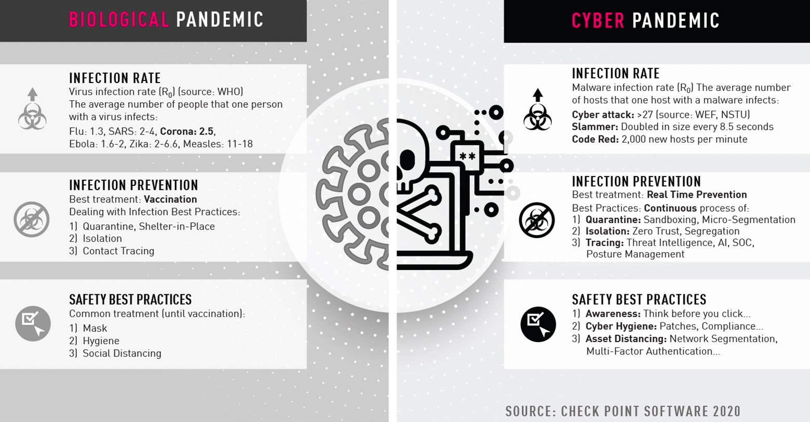

## **A “cyber pandemic” is a reality**

  

Just like we have a virus based pandemic, the cyber pandemic is probably even more dangerous and life threatening.

Because of how big nations have been preparing their digital supremacy, lots of “viruses” have been created and have been deployed.

- Intel/amd: [info1](https://www.eteknix.com/nsa-may-backdoors-built-intel-amd-processors/), [info2](https://en.wikipedia.org/wiki/Intel_Management_Engine), [info3](https://libreboot.org/faq.html#amd), [info4](https://news.softpedia.com/news/intel-x86-cpus-come-with-a-secret-backdoor-that-nobody-can-touch-or-disable-505347.shtml).
- Qualcomm: [info1](https://www.gsmarena.com/newscomm-49007.php), [info2](https://www.inquisitr.com/4658001/some-smartphones-powered-by-qualcomm-chips-come-with-a-hidden-backdoor/), [info3](https://www.theverge.com/2017/10/15/16479330/oneplus-privacy-complaints-oxygenos-cybersecurity), [info4](https://www.inquisitr.com/4658001/some-smartphones-powered-by-qualcomm-chips-come-with-a-hidden-backdoor/),  [hightech](https://www.chrisdcmoore.co.uk/post/oneplus-analytics/).

There are hundreds of proof points, we just pointed to some. We know for a fact from people who do this work for a living, that +- everything is compromised with pre-planted vulnerabilities.

This is very similar compared to what can happen with a virus based pandemic, you pre-plan bio warfare, we can only imagine what happens after deploying such an attack, a real pandemic where some falsely believe they can control the outcome, this to us is the fastest path to destruction of potentially even the human race. 

The cyber pandemic is comparable, and is already there, maybe not deployed at full scale yet, but these backdoors are there, it's just a matter of time and money before they get exploited on a bigger scale.

In case you want some proof, today for less than 50k USD per year you can get access to someone’s full digital life and footprint (travel, information, data, financial transactions, …). Important people like presidents of course come at a premium.
