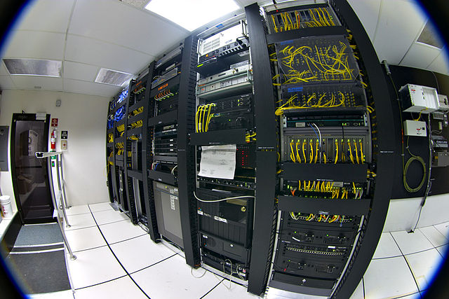

## **The centralized clouds or telecom operators are NOT PRIVATE NOR SECURE**

Most of the info here is harder to find, maybe because it's related to security and google or other centralized providers, but we believe that much if the info on wikileaks is factual and might represent reality, e.g. [Google clouds are connected to NSA and actively searched for](https://www.tweaktown.com/news/33661/new-snowden-leaks-show-the-nsa-captures-google-data-center-traffic/index.html). 

THIS MEANS ANY INFORMATION YOU SEND/RECEIVE ON GOOGLE MAIL AND DOCUMENTS IS NOT PRIVATE NOR SAFE. Please do realize this is NOT ONLY the NSA looking at this, if they can many others can as well and some of them might not do it for the right reasons.

  

We do know the following for a fact though, all telecom operators in Europe have dedicated racks in their datacenters where all voice & sms traffic from that telecom operator gets routed through. These dedicated racks are owned by different countries in the world. I am not questioning that this might be a good practice but the reality is that this leads to security issues and non intended consequences. For sure there is an ethical question, is it normal that citizens do not realize that they are being spied upon by different governments not related to their own, there is no transparency about this. Again a case can be made that this type of traffic needs to be monitored but why does this have to be done by multiple out of country organizations which might allow other hackers to abuse this situation and it does happen. 

It's possible that these monitoring probes are heavily targeted by hackers all over the world and probably compromised.
