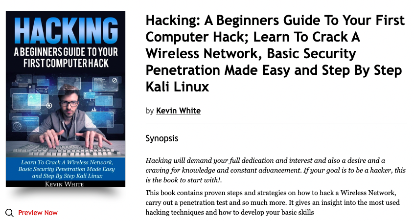

## **It's easy to hack, using existing vulnerabilities**

  

Info can be found on the internet and can be done by not even serious experts.

- e.g. a [youtube training](https://www.youtube.com/watch?v=cgM-_42rWbM).
- e.g. on [medium](https://medium.datadriveninvestor.com/creating-windows-os-backdoor-with-msfvenom-ba56567eb088).
- Other: [example](https://www.wikihow.com/Create-a-Nearly-Undetectable-Backdoor-using-MSFvenom-in-Kali-Linux).

I just found these in 2 min google search, it's actually all quite simple and effective.

Sometimes it requires some social engineering or getting people on fake websites but it's a lot less difficult than people might think and it's actually hard to protect against using existing off the shelf components. e.g. firewalls do not help.

I’ve seen kids doing this and even enjoying it because of the feeling of empowerment it gives them.

