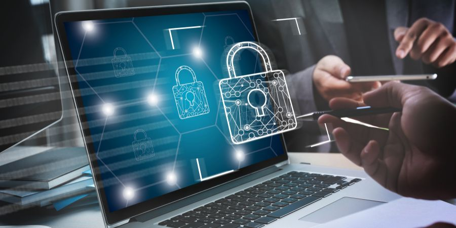

## **People are vulnerable**

  

We are certainly not implying that people are bad by design, but people are the vulnerable part of any IT system. Self-healing systems are the future, they allow systems to run, sometimes protected by consensus mechanisms like on blockchain to make sure that human “error” is less of an issue.

People related issues can be:

* Not enough education.
* Genuine mistakes being  made (+90% of issues).
* Bribery sometimes extortion of people who operate/deploy IT systems.
* Manipulation by fear or media, resulting in wrong decisions.
* Ego driven decisions, often IT people are by design unsecure, putting too much power in their hands is not always the wise decision.

Simplicity, education, and transparency is the best solution here.

