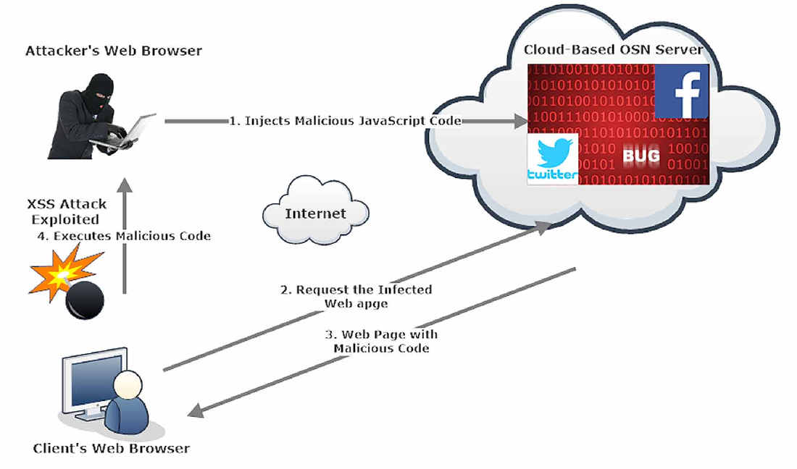
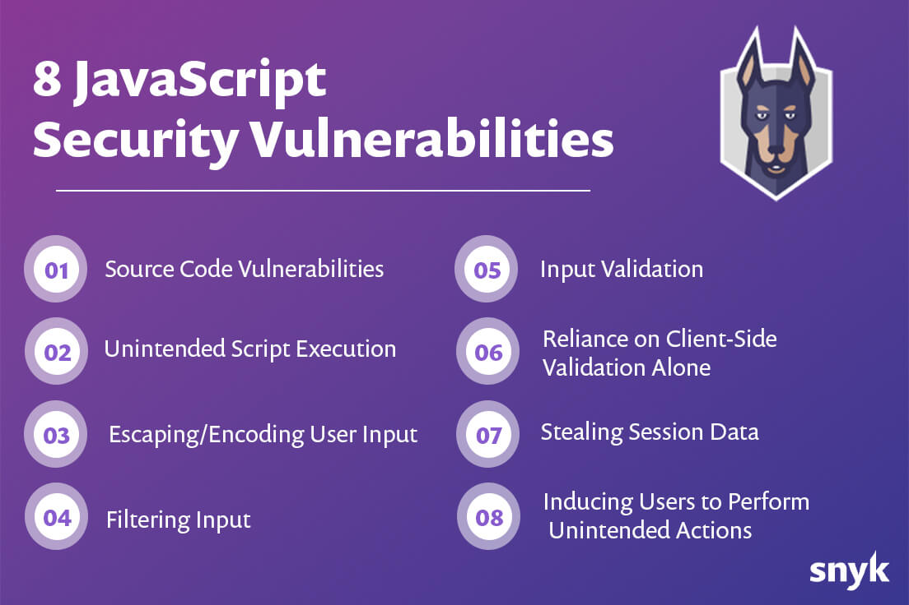
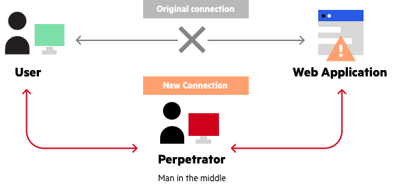

## **Web browsers are extremely dangerous**

  

Web browsers became our new operating system, they execute javascript code at runtime in the browser. Most attacks happen through this, it's extremely difficult to guard against, because inserting javascript inside your browser experience is still not so hard today. It's a very difficult problem that can not be easily resolved because otherwise the user experience would become too complicated and people would opt-out.

Through the inserted javascript code (often through man in the middle attacks) it's rather easy to get access to lots of valuable information and even pretend to be a user.

SSL encryption is super easy to workaround by means of man in the middle attach.

### Javascript Too Easy To Mislead

  

JavaScript security is related to investigating, preventing, protecting, and resolving security issues in applications where JavaScript is used.

JavaScript itself is a fundamental technology for building web applications and is also very popular for building server-side, desktop, and even mobile applications. It’s widespread popularity, however, also makes it a prime target for hackers, looking to target it through various attack vectors. Because JavaScript is used mostly in the front-end, it makes sense to focus first on JavaScript security issues in browsers.

Most common JavaScript attacks vectors include: executing malicious script, stealing a user’s established session data or data from the browser’s localStorage, tricking users into performing unintended actions, exploiting vulnerabilities in the source code of web applications.

Of course, this list is by no means exhaustive; rather, it is more focused on the front-end aspect of web applications.

  

### Man In The Middle Attach

  

A man in the middle (MITM) attack is a general term for when a perpetrator positions himself in a conversation between a user and an application—either to eavesdrop or to impersonate one of the parties, making it appear as if a normal exchange of information is underway.

The goal of an attack is to steal personal information, such as login credentials, account details and credit card numbers. Targets are typically the users of financial applications, SaaS businesses, e-commerce sites and other websites where logging in is required.

Information obtained during an attack could be used for many purposes, including identity theft, unapproved fund transfers or an illicit password change.

Additionally, it can be used to gain a foothold inside a secured perimeter during the infiltration stage of an advanced persistent threat (APT) assault.

### Some more info

- https://www.express.co.uk/life-style/science-technology/1270340/Google-Chrome-warning-extensions-danger
- https://www.cpomagazine.com/cyber-security/googles-chrome-web-store-security-is-successful-but-a-bigger-storm-is-brewing/ 
- https://www.imperva.com/learn/application-security/man-in-the-middle-attack-mitm/
- https://snyk.io/learn/javascript-security/
- https://en.wikipedia.org/wiki/Man-in-the-middle_attack